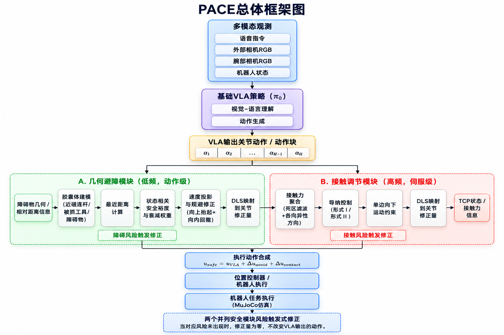
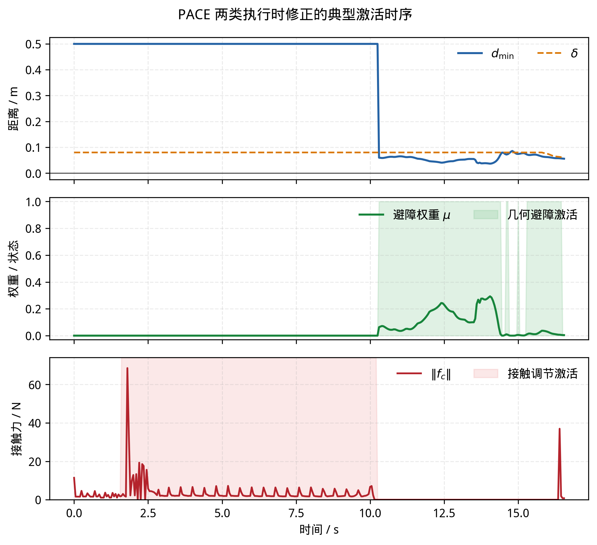
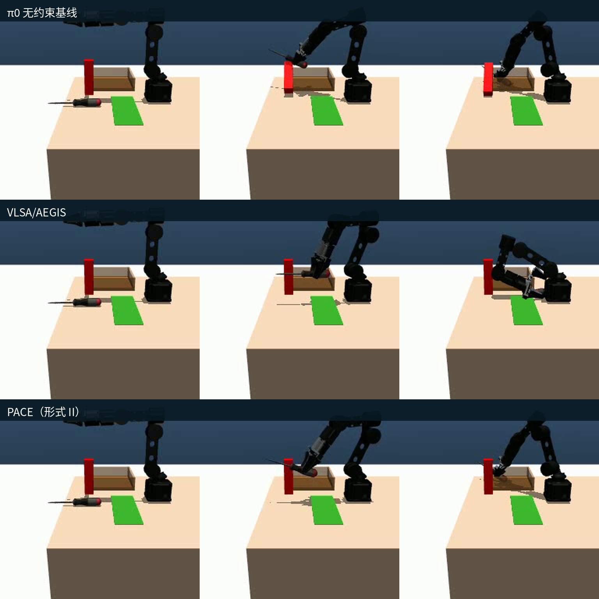
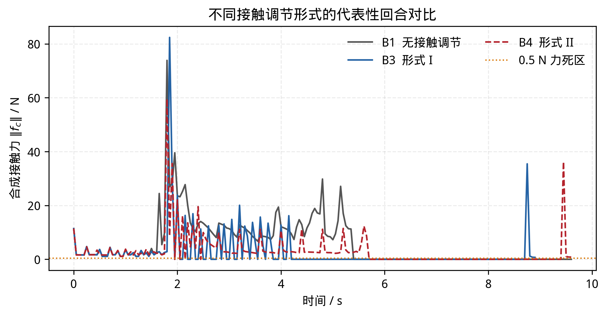
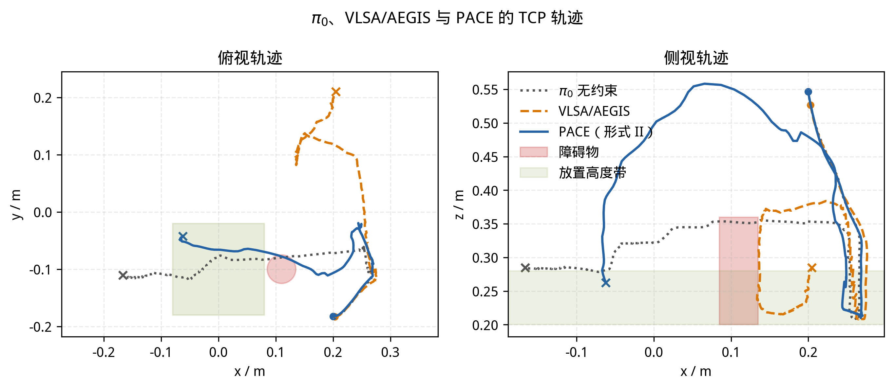

**面向视觉—语言—动作模型物理安全的阶段感知约束执行框架**

**PACE: Phase-Aware Constraint Enforcement for Safe Execution of Vision-Language-Action Policies**

何伟俊¹，于效宇¹，黄之峰²

¹电子科技大学中山学院；²广东工业大学

通讯作者：________；E-mail：________

# 摘要

视觉-语言-动作（Vision-Language-Action，VLA）模型具有较强的任务泛化能力，但由数据驱动策略生成的动作通常不会显式约束碰撞距离和接触冲击。已有的推理阶段安全层多以几何避障为核心，这对于转运过程是合适的，却难以直接覆盖抓取—放置任务中的接触过程：搬运物体时应与障碍物保持距离，下抓时则必须接近甚至接触支撑面。为分别处理这两类风险，本文提出阶段感知约束执行框架 PACE（Phase-Aware Constraint Enforcement）。该框架不改动 π0 的模型结构和动作生成算法，而是在动作执行端并列设置几何避障与接触调节模块。前者通过胶囊体近似、最近距离估计、运动增量投影和有界规避分量修正 VLA 动作；后者依据接触力构造各向异性顺应方向，并以负载相关增益映射或惯性—回正离散递推调节单步运动增量。本文在 MuJoCo 螺丝刀拾放任务上设置 12 种消融配置，每种配置运行 100 个随机初始化回合。在有障碍且不启用接触调节时，几何避障使任务成功率由 62% 提升至 95%，障碍物碰倒率由 92% 降至 1%。同时启用两个模块后，两种接触调节形式的碰倒率分别为 12% 和 9%，平均接触冲量分别为 29.38 N·s 和 25.52 N·s，较无约束配置的 159.54 N·s 降低 81.6% 和 84.0%，任务成功率分别为 64% 和 77%。在本文采用的各自完整执行链路下，PACE 相较迁移到同一仿真环境的 VLSA/AEGIS 获得了更高的成功率和更低的接触冲量。由于两者的障碍物几何输入来源不同，该结果属于系统级比较，不能单独归因于安全控制算法。在本文仿真拾放任务中，将空间干涉与接触载荷分开处理，有助于在任务完成和物理安全之间取得更合适的平衡。

关键词：视觉—语言—动作模型；机器人安全；执行时约束；几何避障；接触顺应

# 1 引言

视觉-语言-动作（Vision-Language-Action，VLA）模型将视觉观测、语言指令和机器人动作纳入同一策略，为机器人执行多种操作任务提供了一条端到端路径。RT-2[4]、OpenVLA[16]、Octo[18] 和 π0[3] 等工作不断拓展模型的多任务操作和指令泛化能力。其中，π0 通过流匹配动作专家生成连续动作，能够为复杂操作提供较为平滑的动作序列。

但会完成任务并不意味着能够安全地完成任务。VLA 通常围绕任务完成和动作模仿进行训练，机械臂与障碍物之间应保留多大间隔、接触瞬间应承受多大载荷，并不一定包含在模型的显式约束中。当场景偏离训练分布或临时出现障碍物时，策略仍可能继续朝目标运动，由此引发碰撞或过大的接触冲击，损伤末端工具、被操作物体甚至机器人本体[7,8]。

已有工作主要从训练阶段和推理阶段两条路径改善上述问题（详见第 2 节）。其中，推理阶段方法在策略输出与执行器之间增加独立安全层，无需重新设计 VLA 的动作生成流程，因而更便于接入已有模型。VLSA[8] 中提出的插件式安全层 AEGIS 是这类方法的代表，本文后续将该完整方法简称为 VLSA/AEGIS。

对于抓取—放置操作，单纯用几何间隔描述安全仍不够。机械臂搬运已抓取物体时，最近距离能够直接反映其与环境发生干涉的风险；进入下抓阶段后，末端必须接近并接触支撑面，若仍要求始终保持非接触距离，安全约束反而会妨碍任务完成。此时真正需要限制的是接触力峰值和累积冲量。因此，同一任务中实际上存在空间碰撞与接触冲击两类不同风险，二者不宜由一套距离约束统一处理。

两类风险发生的时间尺度也不同。避障可以依据相对位姿，在动作更新时作局部调整；接触冲击的变化更快，需要在低层执行环中持续观测和调节。基于这一差异，本文不让单一约束贯穿整个动作过程，而是根据当前可观测状态启用相应的保护机制。

据此，本文提出面向现有 VLA 策略的插件式执行约束框架 PACE（Phase-Aware Constraint Enforcement）。PACE 保留 π0 给出的关节目标，只在检测到风险时作局部修正。框架中的几何避障和接触调节模块处于同一层级，但各自处理不同问题：几何模块根据胶囊体最近距离和分离法向去除危险运动分量，并在末端接近放置目标时缩小安全裕度，避免约束妨碍最终放置；接触模块则在末端进入支撑面邻域后，根据接触力施加各向异性顺应修正。本文为接触模块设计了负载相关增益映射和惯性—回正离散递推两种实现。两类修正均采用闭式计算，并通过阻尼最小二乘（DLS）逆映射转换到关节空间，因此不需要修改基础 VLA 的内部结构。

没有检测到相应风险时，模块不产生修正，或将已有修正平滑释放，执行指令随之回到基础 VLA 输出。换言之，PACE 不负责替代 VLA 规划任务，只负责在执行端处理局部物理风险。

本文的主要贡献如下：

（1）指出接触型操作不能只用几何间隔衡量安全，并将空间碰撞与接触冲击明确为两类需要分别处理的执行风险。

（2）提出插件式 PACE 框架，在不改动 π0 内部结构和动作生成算法的情况下，将胶囊体局部避障与各向异性接触顺应并列接入执行端。几何模块根据目标邻近状态调整安全裕度和干预权重，接触模块根据 TCP 高度与实时接触力启动，从而减少不必要的修正。

（3）通过 MuJoCo 螺丝刀拾放任务中的 12 种消融配置检验两个模块，每种配置运行 100 个随机初始化回合。有障碍且关闭接触调节时，几何避障使 SR 由 62% 升至 95%、CR 由 92% 降至 1%；两个模块同时启用后，负载相关增益实现和惯性—回正离散递推实现分别将平均接触冲量降低 81.6% 和 84.0%，对应的 CR 为 12% 和 9%，SR 为 64% 和 77%。

# 2 相关工作

视觉-语言-动作模型。VLA 将视觉观测和自然语言指令直接映射为机器人动作。RT-2[4]、OpenVLA[16] 与 Octo[18] 分别从大规模视觉语言预训练、开放模型和通用策略学习等方向推进了这一研究路线；π0[3] 使用流匹配动作专家生成连续动作，π0.5[13] 又进一步拓展到开放世界场景。本文选择 π0 作为基础策略，使用其连续动作输出驱动机器人，并在外部执行链中加入物理安全修正，不介入模型内部的动作生成过程。

VLA 安全增强。现有方法大致分为训练阶段安全增强和执行阶段安全约束两类[15]。前者通过安全数据、奖励或约束目标改变策略的学习过程，例如 SafeVLA[21] 将安全要求纳入模型优化。这种做法能够直接影响策略的动作分布，但也意味着需要重新训练或适配模型。执行阶段方法则在 VLA 输出之后处理动作，可以保留原有的视觉、语言和动作生成流程。PACE 采用后一种思路，研究重点不是重新训练 VLA，而是如何在动作真正执行之前对其作必要修正。

几何安全约束。控制屏障函数（CBF）通过定义安全集并对控制输入施加不等式约束，为机器人避碰提供了较为系统的处理方式[1,2,5]。VLSA/AEGIS[8] 将其接入 VLA 推理链路：视觉语言模块先识别与任务有关的障碍物并恢复几何信息，CBF-QP 再以尽量小的改动修正 VLA 动作。这种几何安全层适合要求机器人与障碍物保持距离的场景。问题在于，下抓动作本身就要求末端接近支撑面，此时严格的间隔约束可能与任务目标冲突，而接触力峰值和累积冲量更能反映潜在损伤。PACE 的几何模块同样位于执行端，但采用胶囊体最近距离、运动增量投影和有界规避分量进行局部修正，并在接近放置目标时逐步减小干预。

能量引导与反应式避障。OmniGuide[19] 把避障和语义定位等要求写成可微能量场，再借助可微运动学将引导梯度作用到生成轨迹上。经典人工势场方法[14] 使用吸引场和排斥场实现实时避障，但存在局部极小、振荡以及目标邻近障碍物时的 GNRON 问题[6,17]。本文不重新规划整条轨迹，而把 VLA 已生成的动作看作任务意图，只在局部风险区域有限度地改变运动方向。为此，几何模块在远离目标时保留足够的避障作用，接近放置区域后则通过状态相关安全裕度和目标衰减权重逐步释放修正。

力感知与顺应操作。随着 VLA 被用于更多接触丰富型任务，力和力矩反馈也开始进入策略建模。ForceVLA[10]、TA-VLA[11] 与 FD-VLA[12] 分别利用力感知混合专家、扭矩信息和力信息蒸馏增强模型对物理交互的表征，但都需要相应的训练或适配。CompliantVLA-adaptor[9] 采用外部适配器，结合视觉语言任务语境与实时力/力矩反馈调节刚度和阻尼。PACE 也在执行端进行顺应调节，不过它直接用实时接触力构造各向异性的单步运动增量，因此可以与冻结的基础策略组合。该模块负责接触风险，几何模块负责空间干涉，两者共同组成 PACE 的执行约束。

这些工作说明，VLA 的物理安全可以从策略训练、几何约束、能量引导和力感知控制等不同层面改善。本文关注的不是用其中一种机制取代另一种，而是抓取—放置任务中同时出现的两类风险：携带工具运动时可能碰到障碍物，接近支撑面建立接触时又可能产生较大冲击。与 VLSA/AEGIS 相比，PACE 不只处理几何分离，还单独调节接触载荷；与 OmniGuide 相比，PACE 不通过能量梯度引导整段生成轨迹，而是在执行端局部修正已生成动作；与 CompliantVLA-adaptor 相比，PACE 同时覆盖障碍干涉与接触载荷，并可直接接入冻结的基础策略。上述差异决定了 PACE 采用两个并列风险模块，同时保留基础 VLA 的视觉—语言理解和动作生成能力。

# 3 问题建模

系统与任务。实验对象为一台带平行夹爪的 6 自由度机械臂，关节目标由位置控制器跟踪。机器人根据外部相机图像、腕部相机图像、本体状态和语言指令，执行“抓取螺丝刀并放入储物盒”的任务。加入障碍物后，支柱位于螺丝刀与储物盒之间，VLA 原本生成的转运轨迹可能与其发生碰撞。

基础策略。π0 根据当前多模态观测输出长度为 $H$ 的动作块，其中前六维为绝对关节目标，夹爪维度用于控制开合。对任一动作 $a$，其相对于当前关节状态 $q$ 的差值定义为

$$
\Delta q^{\mathrm{vla}}=a_{1:6}-q
\tag{1}
$$

式（1）给出了本文使用的 VLA 单步关节位移 $\Delta q^{\mathrm{vla}}$。PACE 保留 π0 的视觉、语言和动作生成过程，只在动作送入位置控制器之前进行修正。

安全对象。本文考虑两类物理风险。第一类是机械臂远端及被抓取工具与环境障碍物之间的空间干涉，用胶囊体最小表面距离 $d_{\min}$ 描述；第二类是末端接近支撑面并建立接触时产生的冲击，用合成接触力峰值及其时间积分（接触冲量）描述。系统根据可观测状态分别判断两类风险，不为整个任务预先指定统一的阶段标签或距离约束。

目标。PACE 的目标是在尽量保留 VLA 原始任务意图的前提下，降低障碍干涉和接触冲击。它只在检测到相应风险时生成附加修正；风险消失后，修正量立即回到零或平滑衰减至零，系统重新直接执行基础策略的动作。

# 4 方法：PACE

## 4.1 概述

PACE 接在基础 VLA 的动作输出之后，由几何避障和接触调节两个并列模块组成。几何模块根据胶囊体最近距离与分离法向修正可能引起障碍干涉的运动分量；接触模块则根据 TCP 高度和接触力，调节末端的单步接近增量与顺应运动。两个模块处理不同的物理风险，但都以同一份 VLA 动作为参考。

这里的“阶段感知（Phase-Aware）”并不是预先把任务划分为抓取、转运和放置等离散阶段，也不需要额外训练阶段分类器。本文所说的“阶段”是约束需求随执行状态变化而形成的功能阶段，而不是预先给定的任务标签：工具或 TCP 高度、障碍物最小距离和接触力共同决定当前需要几何约束、接触约束还是直接执行基础动作。因此，同一个基础策略进入自由空间、障碍物邻域和接触邻域时，会得到不同的执行保护；相应风险消失后，修正随即置零或平滑释放。

具体来说，工具尚未抬升，或障碍物仍在安全裕度之外时，几何模块不工作；工具抬升后，一旦最小距离进入安全裕度，几何修正开始介入。TCP 低于接触激活高度后，接触模块进入工作区；TCP 低于支撑面参考高度且命令仍向下时，模块截断中间笛卡尔增量的法向分量，接触力超过死区后再叠加力相关顺应增量。条件不再满足时，几何修正直接归零，接触顺应状态按释放系数逐步衰减。这种由可观测条件触发相应模块的方式，就是本文所说的阶段感知。

两类修正都先在笛卡尔空间中计算，再通过阻尼最小二乘（DLS）逆映射到关节空间。它们在功能上并列处理不同风险，但实际执行采用串行的多速率结构：几何模块先在动作更新时生成经过平滑和限幅的关节目标，接触模块随后在每个物理子步上对该目标作进一步修正。由于风险判断与修正都发生在模型输出之后，PACE 无需重写基础 VLA 的动作生成算法。本文所称“约束执行”是指对基础动作施加有界修正，并不构成对离散闭环系统硬安全性的理论保证。

在实现中，π0 每次返回一个动作块，系统按固定周期更新动作目标，并在频率更高的 MuJoCo 物理子步中执行。几何避障随动作目标更新，接触调节则在每个低层子步中持续计算。这样的多速率安排用于匹配两类风险不同的变化速度，并不改变两个模块的并列关系。图 1 给出了整体结构，第 4.2 节和第 4.3 节分别介绍其具体计算。

图 1 PACE 总体框架图

## 4.2 接触调节模块

接触调节模块的作用是避免末端在支撑面附近承受过大的接触载荷。当 TCP 低于设定高度后，模块开始参与执行。在每个低层子步中，系统读取末端远端刚体或被抓取工具相关的接触力，将其从接触坐标系转换到世界坐标系，再进行累加。式（2）给出了这一计算：集合 $\mathcal K$ 中各接触点的局部力经旋转矩阵 $R_i$ 变换后，得到合成接触力 $f_c$：

$$
f_c=\sum_{i\in\mathcal{K}}R_i^{\mathsf T}f_i
\tag{2}
$$

式（3a）使用力死区 $f_d$ 得到有效载荷 $e_f$；式（3b）根据加权接触力构造顺应方向 $n_f$；式（3c）定义切向权重矩阵 $W$：

$$
e_f=\max\!\left(\lVert f_c\rVert-f_d,0\right)
\tag{3a}
$$

$$
n_f=\frac{Wf_c}{\lVert Wf_c\rVert+\varepsilon}
\tag{3b}
$$

$$
W=\operatorname{diag}(w_t,w_t,1)
\tag{3c}
$$

其中，$w_t<1$ 用于减弱切向分量。代码在读取 MuJoCo 接触力后统一翻转竖直分量为负的力，使 $f_c$ 指向离开支撑面的方向，因此沿 $+n_f$ 叠加顺应增量会减小压向支撑面的载荷。式（3a）—式（3c）的处理使接触修正主要沿支撑面法向产生，同时保留大部分切向运动意图。

得到有效载荷与顺应方向后，本文比较两种离散顺应实现。基础策略输出的是绝对关节目标，因此雅可比映射后的量在这里不解释为连续时间速度，而是每次控制更新对应的单步笛卡尔运动增量，记为 $\xi$。形式 I 使用负载相关增益，将力误差直接映射为顺应增量，并用低通滤波抑制突变；形式 II 使用由惯性参数和回正参数决定的一阶离散递推，逐步更新顺应增量。两种形式采用相同的单步增量上限，主要区别在于修正建立的速度和平滑程度。

形式 I 的计算过程如式（4a）—式（4c）所示：式（4a）根据接触力模长调整力—位移增益 $K_f$，式（4b）生成并限幅理想顺应增量，式（4c）通过低通滤波得到最终修正量：

$$
K_f=k_0+k_1\lVert f_c\rVert
\tag{4a}
$$

$$
\xi_{\mathrm{id}}=\operatorname{sat}_{\xi_{\max}}(K_f e_f n_f)
\tag{4b}
$$

$$
\xi_c^{\mathrm{I}}=\operatorname{LPF}_{\alpha}(\xi_{\mathrm{id}})
\tag{4c}
$$

形式 II 首先按照式（5a）对接触力进行指数滤波，再按照式（5b）更新带有回正项的单步顺应增量：

$$
\hat f_c^{(j)}=\lambda f_c^{(j)}+(1-\lambda)\hat f_c^{(j-1)}
\tag{5a}
$$

$$
\xi_c^{\mathrm{II},(j+1)}=\operatorname{sat}_{\xi_{\max}}\!\left[
\left(1-\frac{B\Delta t_s}{M}\right)\xi_c^{\mathrm{II},(j)}
+\frac{\Delta t_s}{M}\hat e_f^{(j)}\hat n_f^{(j)}
\right]
\tag{5b}
$$

形式 II 中，$j$ 表示低层物理子步，$\Delta t_s$ 为子步时间，滤波后的有效载荷为 $\hat e_f^{(j)}=\max(\lVert\hat f_c^{(j)}\rVert-f_d,0)$，对应的顺应方向为 $\hat n_f^{(j)}=W\hat f_c^{(j)}/(\lVert W\hat f_c^{(j)}\rVert+\varepsilon)$。式（5b）与实现中的递推更新严格等价，其中 $\xi_c^{\mathrm{II}}$ 始终表示单步笛卡尔修正量而非连续时间速度；$M$ 与 $B$ 分别为位移状态递推的等效惯性参数和回正参数，使 $\Delta t_s/M$ 的量纲为 m/N、$B\Delta t_s/M$ 为无量纲。二者均为离散控制递推参数，不对应机械臂或负载的真实物理质量与阻尼。若 TCP 已低于支撑面参考高度且目标运动增量仍指向支撑面，则将该法向增量截断为零，以限制继续向下运动。离开接触邻域后，顺应状态按固定衰减系数平滑释放，避免控制量突变。

代码在每个低层子步中先计算固定几何目标相对当前关节状态的剩余位移，再将其映射为 TCP 单步运动增量。记第 $j$ 个子步的当前关节状态为 $q^{(j)}$，几何模块在本动作周期给出的固定目标为 $u_{\mathrm{geo}}$，原始笛卡尔增量为 $\xi_{\mathrm{raw}}^{(j)}=J_{\mathrm{tcp}}^{(j)}(u_{\mathrm{geo}}-q^{(j)})$。代码随后根据 TCP 到支撑面的距离对其竖直分量作缩放，记所得中间量为 $\xi_{\mathrm{cmd}}^{(j)}=\mathcal B_z(\xi_{\mathrm{raw}}^{(j)})$；若 TCP 已低于支撑面参考高度，则算子 $\mathcal T_z(\cdot)$ 将其中仍指向支撑面的法向分量截断为零。根据所选接触形式，令 $\xi_c^{(j)}=\xi_c^{\mathrm I,(j)}$ 或 $\xi_c^{\mathrm {II},(j)}$，于是 $\xi_{\mathrm{tgt}}^{(j)}=\mathcal T_z(\xi_{\mathrm{cmd}}^{(j)})+\xi_c^{(j)}$。式（6）将目标增量与中间命令增量之差通过 TCP 平移雅可比的阻尼最小二乘逆映射到关节空间：

$$
\Delta q_{\mathrm{con}}^{(j)}
=J_{\mathrm{tcp},\rho}^{\dagger,(j)}
\left(\xi_{\mathrm{tgt}}^{(j)}-\xi_{\mathrm{cmd}}^{(j)}\right)
\tag{6}
$$

其中，$J_{\mathrm{tcp},\rho}^{\dagger,(j)}$ 为第 $j$ 个子步 TCP 平移雅可比的带阻尼伪逆。式（6）只把法向截断与顺应造成的笛卡尔增量差映射回关节空间；完整执行命令将在第 4.4 节结合几何目标统一给出。

## 4.3 几何避障模块

几何避障模块主要处理转运过程中机械臂远端或被抓取工具与障碍物发生干涉的问题。为了避免在控制循环中反复计算网格距离，本文用胶囊体近似腕部远端、螺丝刀和障碍支柱。工具抬升后，模块计算各活动胶囊与障碍胶囊轴线之间的最近点，并找出表面距离最小的一对几何体。式（7）用轴线最近点距离减去双方半径，得到胶囊体最小表面距离；式（8）给出该几何对的单位分离方向：

$$
d_{\min}=\min_i\left(\lVert c_i^{\star}-c_o^{\star}\rVert-r_i-r_o\right)
\tag{7}
$$

$$
n=\frac{c_i^{\star}-c_o^{\star}}
{\lVert c_i^{\star}-c_o^{\star}\rVert}.
\tag{8}
$$

其中，$c_i^{\star}$ 与 $c_o^{\star}$ 分别为第 $i$ 个活动胶囊轴线与障碍胶囊轴线上的最近点，$r_i$ 和 $r_o$ 为二者半径；主导几何对即取得最小表面距离的一对胶囊，$n$ 指向远离障碍物的分离方向。被抓取工具在夹爪闭合且位于 TCP 邻域内时加入活动胶囊集合，使细长工具带来的额外扫掠体积能够进入避障判断。

如果放置目标本身靠近障碍物，固定安全距离可能使机械臂迟迟无法到达目标。为减轻这种干预，本文根据 TCP 到放置目标的距离 $\rho$ 调整安全裕度 $\delta$。如式（9）所示，$\delta$ 随 $\rho$ 线性变化，同时受给定上下界限制：

$$
\delta=\operatorname{clip}
\left(\delta_0+\kappa\rho,\delta_{\min},\delta_{\max}\right)
\tag{9}
$$

在安全裕度基础上，式（10a）将总激活权重 $\mu$ 分解为障碍接近因子 $\mu_d$、目标邻域衰减因子 $\mu_g$ 和回合初始渐入因子 $\mu_s$；式（10b）—式（10d）分别给出三个因子的计算方式，从而编码距离风险、目标接近程度与回合开始后的渐入过程。其中，$k$ 为当前回合的动作更新计数，$K_0$ 为渐入长度：

$$
\mu=\mu_d\mu_g\mu_s
\tag{10a}
$$

$$
\mu_d=\left[\frac{\delta-\max(d_{\min},0)}{\delta}\right]^2
\tag{10b}
$$

$$
\mu_g=\operatorname{clip}
\left(\frac{\rho-\rho_0}{\Delta\rho},0,1\right)
\tag{10c}
$$

$$
\mu_s=\operatorname{clip}\left(\frac{k}{K_0},0,1\right),
\qquad d_{\min}<\delta
\tag{10d}
$$

当 $d_{\min}\geq\delta$ 时，令 $\mu=0$。

按照这一设计，机械臂远离放置目标时保留较大的安全裕度；接近目标后，安全裕度逐渐收缩到预设下界，干预权重也随之减弱。当 $\mu$ 小于设定阈值时，模块不再施加修正，以免微小调整不断累积。

避障修正直接作用于 VLA 输出对应的单步笛卡尔运动增量。记 $J_b\in\mathbb R^{3\times6}$ 为主导活动胶囊所属机器人刚体的平移雅可比，则 $\xi_{\mathrm{vla}}=J_b\Delta q_{\mathrm{vla}}$。如式（11）所示，首先移除其中指向障碍物的法向分量；随后按照式（12）叠加由权重 $\mu$ 调节的抬升、向内回缩和径向分离增量：

$$
\xi_{\mathrm{proj}}
=\xi_{\mathrm{vla}}-\min\left(\xi_{\mathrm{vla}}^{\mathsf T}n,0\right)n
\tag{11}
$$

$$
\xi_{\mathrm{safe}}
=\xi_{\mathrm{proj}}+\mu
\left(w_u\hat e_{\mathrm{up}}+w_r\hat e_{\mathrm{in}}+w_n n\right).
\tag{12}
$$

其中，$\hat e_{\mathrm{up}}$ 与 $\hat e_{\mathrm{in}}$ 分别表示经过非接近投影后的竖直抬升单位方向和指向机器人基座内侧的回缩单位方向。这种设计不重新规划完整路径，而是在保留 VLA 原始运动趋势的基础上对局部危险运动进行偏转。式（4b）和式（5b）中的 $\operatorname{sat}_{\xi_{\max}}$ 按向量范数进行饱和，式（16）中的 $\operatorname{sat}(\cdot,\pm\Delta_{\max})$ 则对应代码中的逐关节截断。

笛卡尔修正同样经 DLS 逆映射到关节空间。如式（13）所示，安全增量与原始增量之差被转换为关节空间避障修正；式（14）将其与 VLA 输出合成为候选关节位移，式（15）对候选位移进行一阶平滑，其中 $\Delta q^{-}$ 表示上一次动作更新保存的平滑位移；式（16）完成逐关节单步限幅并生成几何模块目标 $u_{\mathrm{geo}}$：

$$
\Delta q_{\mathrm{avo}}
=J_{b,\rho}^{\dagger}\left(\xi_{\mathrm{safe}}-\xi_{\mathrm{vla}}\right)
\tag{13}
$$

$$
\Delta q_c=\Delta q_{\mathrm{vla}}+\Delta q_{\mathrm{avo}}
\tag{14}
$$

$$
\Delta q=\beta\Delta q_c+(1-\beta)\Delta q^{-}
\tag{15}
$$

$$
u_{\mathrm{geo}}=q+\operatorname{sat}
\left(\Delta q,\pm\Delta_{\max}\right).
\tag{16}
$$

当障碍物未启用、工具尚未进入转运状态或 $d_{\min}$ 不小于当前安全裕度时，$\Delta q_{\mathrm{avo}}$ 为零，模块不改变基础策略的运动意图。

## 4.4 并列组合与风险触发特性

接触调节与几何避障均以同一份 VLA 动作为起点，但代码中的计算顺序并非对称相加。几何模块先在每个动作更新周期生成关节目标 $u_{\mathrm{geo}}$；该目标在随后的 50 个物理子步中保持不变，接触模块则根据每个子步的当前关节状态和接触力继续修正。两个模块在功能上分别处理障碍干涉与接触载荷，在实现上形成“几何目标在前、接触修正在后”的串行组合。当前任务中两类风险通常不会同时出现，因此没有另外设置离散的优先级切换器。

结合式（6）与式（16），第 $j$ 个物理子步实际送入位置控制器的 6 维关节目标如式（17）所示。夹爪两维命令不经过 PACE，仍采用 π0 的开合输出：

$$
u_{1:6}^{(j)}
=q^{(j)}+\left(u_{\mathrm{geo}}-q^{(j)}\right)
+\Delta q_{\mathrm{con}}^{(j)}
=u_{\mathrm{geo}}+\Delta q_{\mathrm{con}}^{(j)}.
\tag{17}
$$

式（17）对应代码中的真实执行顺序：几何模块的平滑与逐关节限幅先作用于动作级目标，接触模块再根据当前子步状态追加 DLS 修正。因此，完整 PACE 并不是把两个未经处理的关节修正同时叠加后再统一限幅。

两类修正都有明确上界：接触顺应增量不超过 $\xi_{\max}$，避障关节位移不超过 $\Delta_{\max}$；DLS 阻尼用于抑制机械臂接近运动学奇异构型时的修正增益。没有对应风险时，几何修正直接归零，接触模块的内部状态则按释放系数逐步衰减。因而，PACE 只在局部风险出现时改变 VLA 动作。

图 2 PACE 两类执行时修正在单个成功回合中的典型激活时序。上图为最小表面距离 $d_{\min}$ 与安全裕度 $\delta$，中图为避障权重 $\mu$ 与几何避障激活状态，下图为合成接触力与接触调节激活状态。阴影区域表示对应模块的激活区间。

# 5 实验设置

## 5.1 实验平台与任务

实验使用 MuJoCo[20] 搭建的定制场景，包括 6 自由度机械臂、平行夹爪、工作台、螺丝刀、储物盒和一个可选的障碍支柱。螺丝刀的初始位置从给定平面区域中采样。启用障碍物后，支柱位于螺丝刀与储物盒之间，机械臂按原始 VLA 轨迹转运时容易与其发生干涉。本文报告的结果均来自仿真实验。

图 3 统一初始位置下的典型执行过程。由上至下分别为 π0 无约束基线、VLSA/AEGIS 与 PACE（形式 II：惯性—回正离散递推）；由左至右分别展示初始状态、障碍物邻域内的执行状态和回合结果。图中 π0 对障碍支柱造成明显扰动，VLSA/AEGIS 保持了几何分离但未完成放置，PACE 则在绕开支柱后继续向放置区域运动。该图仅用于说明三种方法的典型行为差异，定量结论以表 1 和表 2 的统计结果为准。

基础策略。π0[3] 通过 OpenPI WebSocket 接口提供服务，输入为外部相机与腕部相机的 256×256 RGB 图像、8 维本体状态和语言指令，每次返回长度为 8 的动作块。MuJoCo 时间步长为 0.001 s；每个动作目标执行 50 个物理子步，对应约 20 Hz 的动作更新频率；接触调节模块在 1 kHz 物理子步中更新，π0 每 8 个动作重新查询一次，对应约 2.5 Hz 的策略查询频率。

回合协议。机械臂每回合从零点构型开始。本轮 B1–B12 消融实验未启用固定评测模式，螺丝刀初始平面位置在 $x\in \left[0.20,0.35\right]$ m、$y\in \left[−0.15,−0.05\right]$ m 范围内独立均匀采样，各组采用相同采样分布但不共享逐回合的固定初始位置。单回合在任务成功或达到 600 个动作步时终止，每组运行 100 回合。

判定标准。储物盒有效区域在世界坐标系中定义为 $|x+0.05|<0.12$ m、$|y|<0.12$ m 且 $z<0.34$ m。螺丝刀进入该区域并完成释放，且上述状态连续保持 5 个动作步时记为任务成功；未在 600 个动作步内满足该条件的回合记为失败。释放状态由夹爪打开指令大于 0.02，或 TCP 与螺丝刀中心距离大于 0.06 m 判定。障碍物碰倒率 CR 仅表示支柱被碰倒的回合比例，而非任意接触事件的发生率；当支柱局部 $z$ 轴在世界坐标系中的竖直分量 $R_{zz}<0.9$，即支柱相对竖直方向的倾角超过约 25.8° 时，将该回合记为障碍物碰倒。

## 5.2 消融实验设计

消融实验分别控制障碍物、几何避障和接触调节三个因素。B1–B6 不设置障碍物，B7–B12 设置障碍物。两种工况都包含基础策略、仅启用几何避障、分别启用接触调节形式 I 或形式 II，以及将几何避障与两种接触形式组合起来的配置，共 12 组，每组运行 100 回合。B11 和 B12 都属于完整 PACE，仅接触调节的实现形式不同。

结果分析采用单因素对照。比较几何避障时保持接触调节配置不变；比较接触调节时，则保持障碍物条件和几何避障配置不变。

## 5.3 VLSA 对比基线

外部对比选用 VLSA[8] 中提出的插件式安全层 AEGIS，即前文简称的 VLSA/AEGIS，并将其视觉语言识别、几何感知和安全控制流程迁移到本文的 MuJoCo 螺丝刀拾放环境。为了尽量排除任务和平台差异，对比实验使用与 PACE 相同的 π0 基础策略、仿真场景、初始位置采样范围以及成功与碰倒判据。预备验证时，系统实际调用 GLM-4.5V 对障碍物命名，得到描述 `red pillar`。正式重复评测仍采用 `obstacle_source=perception`，但通过参数 `--obstacle_text "red pillar"` 固定这一描述，避免逐回合语言输出的差异影响比较，因此不再在每个回合重新调用 GLM-4.5V。其后的视觉感知流程保持在线运行：GroundingDINO 在两个 RGB 视角中定位候选区域，深度图被反投影到世界坐标系，点云经过工作空间裁剪、离群点剔除、聚类和双视角融合后，再拟合最小体积包围椭球（MVEE）供 CBF-QP 使用。PACE 的几何模块则直接读取仿真环境中的障碍物位姿和几何参数，因此两种方法的几何输入来源并不相同。表 2 衡量的是两套完整执行链路在各自输入条件下的系统级表现，而不是排除感知差异后的安全控制算法对照；同时，VLSA/AEGIS 的结果对应“VLM 预备识别并固定语义查询”设置，而不是每回合重新进行 VLM 命名的端到端性能。

几何表示。按照 AEGIS 的建模方式，末端执行器与任务相关障碍物均用椭球体近似，并由虚拟单位向量 $z$ 确定末端椭球表面的分离支撑方向。本文根据夹爪网格固定末端椭球半轴为 $(0.1046,0.0534,0.1012)$ m；障碍物椭球的中心、姿态和半轴则由双视角感知点云的 MVEE 拟合结果确定，而不是在控制中读取 MuJoCo 障碍物真值。由两椭球的分离切平面构造屏障函数 $h$，$h\geq 0$ 表示代理椭球满足分离条件。

全动作 CBF-QP。基础策略输出的绝对关节目标首先转换为一个动作周期内的名义关节速度，再经末端雅可比映射为名义平移与转动速度。QP 的决策变量为 $u=[v^{\mathsf T},\omega^{\mathsf T},u_z^{\mathsf T}]^{\mathsf T}\in\mathbb R^9$，其中 $u_z$ 用于更新虚拟分离方向。如式（18）所示，优化目标是在权重矩阵 $W_q$ 下最小化安全动作与参考动作之间的偏差；式（19）给出相应的 CBF 安全约束：

$$
u^{\star}=\arg\min_u (u-u_{\mathrm{ref}})^{\mathsf T}W_q(u-u_{\mathrm{ref}})
\tag{18}
$$

$$
\text{s.t.}\quad
a_v^{\mathsf T}(v+\Delta v_s)
+a_\omega^{\mathsf T}(\omega+\Delta\omega_s)
+a_z^{\mathsf T}u_z+\alpha_h h\geq 0,
\tag{19}
$$

其中，$u_{\mathrm{ref}}=[v_{\mathrm{nom}}^{\mathsf T},\omega_{\mathrm{nom}}^{\mathsf T},(k_z\mu_z)^{\mathsf T}]^{\mathsf T}$；$a_v$、$a_\omega$ 与 $a_z$ 为屏障函数对末端平移、转动和辅助状态变化的解析系数，$\mu_z$ 为虚拟状态梯度项。$\Delta v_s=v_{\mathrm{act}}-v_{\mathrm{nom}}$ 与 $\Delta\omega_s=\omega_{\mathrm{act}}-\omega_{\mathrm{nom}}$ 是本文针对位置伺服执行链加入的速度补偿：它以 MuJoCo 当前关节速度计算实际末端运动，并令 CBF 约束作用于“实际运动加安全增量”。当实际速度等于名义速度时，式（19）退化为原 AEGIS 的全动作 CBF 约束，因此该项属于仿真接口适配，而不是对基线 QP 目标和椭球屏障结构的重新设计。

QP 由 OSQP 在每个 0.05 s 动作周期求解。得到安全末端速度后，本文仅将其相对名义速度的差值经阻尼最小二乘逆映射回关节空间，具体关节增量适配过程如式（20）所示：

$$
\Delta q_{\mathrm{vlsa}}
=\operatorname{clip}\!\left[
\left(\dot q_{\mathrm{nom}}+J_{6,\rho}^{\dagger}
\begin{bmatrix}v^{\star}-v_{\mathrm{nom}}\\
\omega^{\star}-\omega_{\mathrm{nom}}
\end{bmatrix}\right)\Delta t_a,
-\Delta q_{\max},\Delta q_{\max}
\right].
\tag{20}
$$

式中，$J_{6,\rho}^{\dagger}$ 为由末端平移与转动雅可比纵向拼接后得到的 6 维阻尼最小二乘逆。位置控制器最终跟踪 $q+\Delta q_{\mathrm{vlsa}}$，夹爪命令保持基础策略输出不变。QP 目标权重为 $W_q=\operatorname{diag}(0.04I_6,I_3)$，屏障增益 $\alpha_h=10$，辅助状态增益 $k_z=10$，DLS 阻尼因子 $\rho=0.05$，单步关节增量上限 $\Delta q_{\max}=0.25$ rad。若 OSQP 未返回最优或近似最优解，则该动作周期回退到名义 VLA 运动，同时记录一次 QP 失败；正式对比不使用仅在拾取后开启约束的诊断门控。上述对比用于考察严格几何分离约束在当前接触型拾放任务中对障碍物风险、任务完成与接触载荷的影响，完整参数列于表 A2。

## 5.4 评价指标

实验从任务完成、障碍物风险和执行载荷三个方面评价各方法。任务与障碍物指标分别为成功率 SR 和碰倒率 CR；接触指标包括平均峰值接触力 $\hat{f}$、全回合平均接触冲量 $I$、成功回合冲量 $I_{\mathrm{succ}}$ 及其标准差 $\sigma_I$；执行负载用平均峰值关节扭矩 $\hat{\tau}_{\max}$ 描述。$\hat{f}$ 的计算方式是先取得每个成功回合的接触力模长峰值，再在成功回合之间求平均，用于比较任务完成条件下的接触品质。$I$ 对全部回合的接触力模长时间积分取均值，因而同时包含失败轨迹的接触代价；$I_{\mathrm{succ}}$ 和 $\sigma_I$ 则只使用成功回合。对于 $\hat{\tau}_{\max}$，先求每个回合中 6 个关节执行扭矩绝对值的时间峰值，再对全部回合取平均。SR 和 CR 另给出基于回合计数计算的 Wilson 95% 置信区间。本文使用这些指标作描述性比较，不据此声称统计显著性。

# 6 实验结果

本节先分析 12 种配置的消融结果，再与迁移到同一场景的 VLSA/AEGIS 进行比较。实验协议和指标定义均见第 5 节。

## 6.1 消融实验结果

表 1 汇总了 12 种消融配置的结果。每种配置包含 100 个随机初始化回合，合计 1200 个评测回合。表中列出各组的模块开关以及任务成功率、障碍物碰倒率、平均峰值接触力和平均接触冲量。形式 I 指负载相关增益的离散增量映射，形式 II 指惯性—回正离散递推。

先看有障碍条件下几何模块的作用。关闭接触调节时，B7 不使用几何避障，B8 只增加几何避障：SR 的点估计从 62% 变为 95%，CR 从 92% 变为 1%。接触调节采用形式 I 时，对应的 B9 与 B11 之间只有几何避障开关不同，CR 分别为 91% 和 12%，SR 分别为 50% 和 64%。采用形式 II 时，B10 与 B12 的 CR 分别为 88% 和 9%，SR 分别为 48% 和 77%。在本次 100 回合评测中，三个启用几何避障的对应配置均观察到更低的 CR 和更高的 SR；各比例的 Wilson 95% 置信区间一并列于表 1。

表 1：12 种消融配置的主要结果

| 组号 | 障碍物 | 几何避障 | 接触调节 | SR (%) [95% CI]↑ | CR (%) [95% CI]↓ | $\hat{f}$ (N)↓ | $I$ (N·s)↓ |
| --- | --- | --- | --- | --- | --- | --- | --- |
| B1 | ✗ | ✗ | — | 95.0 [88.8, 97.8] | — | 73.75 | 74.77 |
| B2 | ✗ | ✓ | — | 93.0 [86.3, 96.6] | — | 78.11 | 95.47 |
| B3 | ✗ | ✗ | I | 88.0 [80.2, 93.0] | — | 66.52 | 15.80 |
| B4 | ✗ | ✗ | II | 83.0 [74.5, 89.1] | — | 79.98 | 22.30 |
| B5 | ✗ | ✓ | I | 95.0 [88.8, 97.8] | — | 67.75 | 9.11 |
| B6 | ✗ | ✓ | II | 83.0 [74.5, 89.1] | — | 72.79 | 23.09 |
| B7 | ✓ | ✗ | — | 62.0 [52.2, 70.9] | 92.0 [85.0, 95.9] | 74.46 | 159.54 |
| B8 | ✓ | ✓ | — | 95.0 [88.8, 97.8] | 1.0 [0.2, 5.4] | 80.86 | 72.08 |
| B9 | ✓ | ✗ | I | 50.0 [40.4, 59.6] | 91.0 [83.8, 95.2] | 75.02 | 24.45 |
| B10 | ✓ | ✗ | II | 48.0 [38.5, 57.7] | 88.0 [80.2, 93.0] | 91.09 | 37.43 |
| B11 | ✓ | ✓ | I | 64.0 [54.2, 72.7] | 12.0 [7.0, 19.8] | 68.33 | 29.38 |
| B12 | ✓ | ✓ | II | 77.0 [67.8, 84.2] | 9.0 [4.8, 16.2] | 74.84 | 25.52 |

注：方括号内为基于 100 回合计数计算的 Wilson 95% 置信区间；无障碍工况不定义 CR。

接触模块的影响先通过无障碍、关闭几何避障的 B1、B3 和 B4 观察。B1 不使用接触调节，平均接触冲量为 74.77 N·s；形式 I 和形式 II 对应的数值分别为 15.80 N·s 和 22.30 N·s。只统计成功回合时，三组的冲量均值依次为 53.22 N·s、5.55 N·s 和 10.57 N·s，标准差依次为 42.31 N·s、3.54 N·s 和 6.46 N·s。在本次评测中，两种接触调节形式均对应更低的成功回合冲量均值及标准差。

在有障碍的完整配置中，B11 和 B12 的平均接触冲量分别为 29.38 N·s 和 25.52 N·s，相比两个安全模块均关闭的 B7（159.54 N·s）下降 81.6% 和 84.0%。这种改善并非没有代价：B11 和 B12 的成功率为 64% 和 77%，低于只使用几何避障的 B8（95%）；平均峰值关节扭矩也由 B7 的 6.28 N·m 增至 7.97 N·m 和 7.56 N·m。形式 I 在成功回合冲量和平均峰值接触力上更低，形式 II 则在任务成功率、障碍物碰倒率和全回合平均冲量上更占优势。因而，若任务更重视成功回合中的低接触载荷，可以选择形式 I；若希望兼顾任务完成、障碍物安全和累计接触载荷，形式 II 在当前场景中更均衡。

图 4 无障碍条件下不同接触调节形式的成功回合接触力时域对比（B1、B3、B4）。三条曲线采用相同固定初始位置，并分别选取能够成功完成任务的回合，用于比较成功执行过程中的动态接触响应，不参与总体性能统计；定量结论以表 1 的统计结果为准。

## 6.2 与 VLSA/AEGIS 的对比

表 2 将 π0 无约束基线、迁移到本文仿真环境的 VLSA/AEGIS 和 PACE 的两种完整配置放在一起比较。各方法都在有障碍条件下运行 100 回合，任务协议和指标定义保持一致；但 PACE 使用仿真真值几何，VLSA/AEGIS 使用在线视觉估计几何，因此该表用于比较各自完整执行链路的系统级表现，不构成排除感知差异后的控制算法对照。

表 2：外部方法综合对比

| 方法 | SR (%) [95% CI]↑ | CR (%) [95% CI]↓ | $\hat{f}$ (N)↓ | $I$ (N·s)↓ | $I_{\mathrm{succ}}$ (N·s)↓ | $\hat{\tau}_{\max}$ (N·m)↓ |
| --- | --- | --- | --- | --- | --- | --- |
| π0 无约束基线（B7） | 62.0 [52.2, 70.9] | 92.0 [85.0, 95.9] | 74.46 | 159.54 | 61.80 | 6.28 |
| VLSA/AEGIS（固定语义查询）[8] | 24.0 [16.7, 33.2] | 0.0 [0.0, 3.7] | 71.27 | 290.38 | 126.85 | 7.22 |
| PACE（负载增益，B11） | 64.0 [54.2, 72.7] | 12.0 [7.0, 19.8] | 68.33 | 29.38 | 6.49 | 7.97 |
| PACE（惯性—回正递推，B12） | 77.0 [67.8, 84.2] | 9.0 [4.8, 16.2] | 74.84 | 25.52 | 12.44 | 7.56 |

注：方括号内为基于 100 回合计数计算的 Wilson 95% 置信区间；↑ 表示越大越好，↓ 表示越小越好；$I_{\mathrm{succ}}$ 仅统计成功回合。

在本次评测中，VLSA/AEGIS 的障碍物碰倒率点估计为 0%，低于 π0 基线的 92%；其任务成功率为 24%，低于 π0 的 62%，全回合平均接触冲量为 290.38 N·s。该现象说明，在当前完整执行链路中，维持严格几何分离与继续完成抓取和放置之间可能存在冲突。PACE 两种完整配置的碰倒率点估计为 12% 和 9%，成功率为 64% 和 77%，平均接触冲量为 29.38 N·s 和 25.52 N·s。需要强调的是，PACE 与 VLSA/AEGIS 的几何输入不同，以上差异不能单独归因于安全控制算法。各方法也只共享初始状态的采样分布，并未共享逐回合初始位置，因此本文仅作组间描述性比较，不作逐回合配对或统计显著性解释。形式 I 与形式 II 的 CR 置信区间存在较大重叠，12% 与 9% 的点估计差异同样不作为稳定优劣结论。

图 5 π0、VLSA/AEGIS 与 PACE（惯性—回正离散递推）在固定初始位置下的 TCP 轨迹对比：左图为俯视轨迹，右图为侧视轨迹；圆点与交叉分别表示轨迹起点和终点。其中 VLSA/AEGIS 采用仿真真值障碍物几何，以隔离感知误差并展示 CBF-QP 的执行行为。本图用于轨迹形态的定性对比，定量结论以表 2 为准。

# 7 讨论与局限

需要说明的是，本文迁移的 VLSA/AEGIS 包含 GLM-4.5V、GroundingDINO、双视角 RGB-D 点云重建、MVEE 拟合和 CBF-QP 安全过滤等模块。预备验证中，GLM-4.5V 实际参与了障碍物命名并给出 `red pillar`；表 2 的重复评测固定使用这一描述，以免逐回合语言输出波动干扰横向比较，因此不再反复请求 GLM-4.5V，其余感知与控制模块仍在线运行。表 2 所反映的应理解为固定语义查询下的感知与安全控制链路性能，而不是逐回合调用 VLM 的完整端到端性能。

此外，原 AEGIS 的连续时间安全结论以几何准确、代理几何完整外包物体且屏障约束持续满足为前提。本文将其接入 20 Hz 绝对关节目标和位置伺服执行链，并为这一接口加入实测速度补偿，不能直接把原有理论保证照搬到当前离散仿真中。因此，本文只根据实际测得的 SR、CR 和接触载荷评价迁移结果；表 2 中 CR 为 0% 只表示本次实验未出现支柱碰倒，不代表一般意义上的零碰撞保证。

PACE 仍有少量避障失败，原因可能来自几何近似和离散更新。当前实现用胶囊体表示远端连杆、工具和障碍物，并且只在动作更新时重算主导分离方向。机械臂位形变化较快或胶囊包络存在误差时，干涉可能在下一次修正前已经发生。局部动作修正也不能代替基础策略的任务规划：如果 VLA 原始动作明显偏离可行区域，避障只能延缓而未必能够挽回任务；接触修正过强时，也可能造成下抓深度不足或释放延迟。两个模块短暂同时介入还会改变基础动作的到达时序。后续可以提高几何更新频率、细化多胶囊表示，并进一步研究两个模块同时工作时的协调方式。

当前规避方向包含向上跨越和向机器人内侧回缩等桌面操作先验，这些经验适合本文的拾放场景，却不能覆盖所有空间结构。面对悬垂障碍、狭窄通道，或障碍物同时影响抓取对齐的情况，固定方向可能反而缩小可行空间。更一般的实现需要根据局部自由空间动态选择规避方向，而不是依赖单一场景经验。

从仿真迁移到真机还存在明显差距。PACE 的几何模块目前直接使用仿真环境给出的障碍物位姿和几何参数，接触模块也直接读取 MuJoCo 接触力；VLSA 定量对比则通过双视角 RGB-D 点云和 MVEE 在线恢复障碍物几何。这种输入差异意味着表 2 比较的是两套完整执行链路，而不能用于单独判断 PACE 几何修正与 AEGIS CBF-QP 的控制算法优劣。真实系统还会受到力传感器噪声与带宽、相机—机器人标定误差、视觉遮挡和在线几何估计误差的影响。当前模块由 TCP 高度、工具抬升状态、最小障碍距离和接触力等条件触发，在螺丝刀拾放任务中足以工作；对于插装、擦拭等过程更复杂的任务，则需要更通用的状态估计，或引入视觉语言语义判断来替代部分启发式条件。

实验范围同样限制了结论的外推。本文只在一种机械臂、一项螺丝刀拾放任务和一类柱状障碍物上进行了 MuJoCo 评测，尚未覆盖不同工具、障碍物形状、场景布局和基础 VLA。各组从相同分布独立采样初始位置，但没有采用逐回合配对设计；本文因此报告 Wilson 置信区间，并把组间差异限定为描述性结果。更广泛的有效性仍需通过多任务、多场景和真机实验检验。

# 8 结论

本文提出 PACE，用于补充 VLA 在执行阶段缺少的物理安全约束。这里的阶段指约束需求随可观测风险状态变化而形成的功能阶段，而不是预先标注的任务标签。PACE 不改变基础 VLA 的模型结构和动作生成算法，而是在动作输出后加入两个功能并列、执行时串行组合的模块。几何模块通过胶囊体距离、状态相关安全裕度和局部运动增量修正减少障碍物干涉；接触模块通过各向异性顺应调节降低接触载荷。两个模块只在相应风险出现时改变基础动作，所施加的是有界执行修正，不构成对离散闭环系统硬安全性的理论保证。

在 MuJoCo 螺丝刀拾放任务的 12 种消融配置中，有障碍且关闭接触调节时，启用几何避障的配置对应 95% 的 SR 和 1% 的 CR，无几何避障配置则为 62% 和 92%。两个模块同时启用时，两种完整配置的平均接触冲量较无约束配置低 81.6% 和 84.0%。负载相关增量映射对应更低的成功回合接触载荷，惯性—回正离散递推则在本次评测中得到更高的成功率、更低的碰倒率点估计和更低的全回合累计冲量；鉴于相关置信区间存在重叠，本文不把两种形式之间的小幅比例差异解释为稳定优势。完整配置的平均峰值关节扭矩高于无约束基线，也表明执行时修正会增加控制负载。在当前任务范围内，PACE 展现出同时处理障碍干涉和接触载荷的能力，但接触调节形式仍需根据任务完成、安全风险与执行负载之间的取舍选择。下一步需要为 PACE 接入在线障碍感知与真实力传感反馈，并在更多操作任务、场景布局和真机平台上检验其适用范围。

# 附录 A 超参数设置

超参数集中列于表 A1。

表 A1：超参数汇总

| 符号 | 含义 | 取值 | 出处 |
| --- | --- | --- | --- |
| $z_s$ | 支撑面高度 | 0.212 m | §3 |
| $z_w$, $z_l$ | 接触激活高度 / 工具抬升判据 | 0.235 m | §4.2, §4.3 |
| $Z_{\mathrm{band}}$ | 接触力筛选高度带 | (0.18, 0.22) m | 式（2） |
| $w_t$ | 切向顺应权重 | 0.1 | 式（3c） |
| $f_d$ | 力死区 | 0.5 N | 式（3a） |
| $k_0$, $k_1$ | 形式 I 增益参数 | $1\times10^{-3}$ m/N，$3\times10^{-3}$ m/N² | 式（4a） |
| $\xi_{\max}$ | 单步顺应增量饱和 | 0.05 m | 式（4b）、（5b） |
| $\alpha$ | 形式 I 滤波系数 | $\operatorname{clip}(0.02+0.01\lVert f_c\rVert,0.02,0.1)$ | 式（4c） |
| $\lambda$ | 形式 II 力预滤波系数 | 0.1 | 式（5a） |
| $M$, $B$ | 形式 II 递推惯性参数 / 回正参数 | 3.0 N·s/m，150.0 N/m（$M/B=20$ ms） | 式（5b） |
| $\eta_v$, $\eta_f$ | 顺应状态释放系数 | 0.92, 0.8 | §4.2 |
| $\rho$ | DLS 阻尼因子 | 0.05 | 式（6）、（13） |
| $r_a$ | 远端连杆胶囊体半径 | 0.07 m | 式（7） |
| $L$, $r_t$ | 工具胶囊体半长 / 半径 | 0.12 m，0.02 m | 式（7） |
| $\delta_0$, $\kappa$ | 安全裕度基值 / 距离系数 | 0.025，0.4 | 式（9） |
| $[\delta_{\min},\delta_{\max}]$ | 安全裕度上下界 | [0.025, 0.08] m | 式（9） |
| $\rho_0$, $\Delta\rho$ | 目标衰减起点 / 宽度 | 0.035 m, 0.065 m | 式（10c） |
| $K_0$ | 回合初始渐入长度 | 15 步 | 式（10d） |
| $\mu_{\min}$ | 修正丢弃阈值 | 0.005 | §4.3 |
| $w_u$, $w_r$, $w_n$ | 抬升 / 回缩 / 径向分离权重 | 0.045，0.020，0.010 | 式（12） |
| $\beta$ | 关节位移低通系数 | 0.6 | 式（15） |
| $\Delta_{\max}$ | 单步关节位移限幅 | 0.25 rad | 式（16） |
| $H$, $N_s$ | 动作块长度 / 每动作子步数 | 8, 50 | §5.1 |

VLSA/AEGIS 迁移基线的参数列于表 A2。带“本文适配”的项目用于连接 π0 绝对关节目标与 MuJoCo 位置伺服器；其余控制结构沿用公开 AEGIS 全动作实现。

表 A2：VLSA/AEGIS 迁移基线参数

| 符号或设置 | 含义 | 取值 | 来源 |
| --- | --- | --- | --- |
| $Q_{\mathrm{eef}}$ | 末端椭球半轴 | (0.1046, 0.0534, 0.1012) m | 夹爪网格拟合，本文适配 |
| 障碍物 MVEE | 障碍物椭球中心、姿态与半轴 | 双视角 RGB-D 点云在线拟合 | VLSA 感知链路 |
| $\alpha_h$ | CBF 屏障增益 | 10.0 | AEGIS 控制结构 |
| $k_z$ | 虚拟分离方向增益 | 10.0 | AEGIS 控制结构 |
| $W_q$ | QP 目标权重 | $\operatorname{diag}(0.04I_6,I_3)$ | AEGIS 控制结构 |
| QP 求解器 | 凸二次规划求解器 | OSQP，允许最优或近似最优状态 | 本文实现 |
| $\Delta t_a$ | 动作更新周期 | 0.05 s（20 Hz） | 本文仿真接口 |
| $\rho$ | 6 维雅可比 DLS 阻尼因子 | 0.05 | 本文适配 |
| $\Delta q_{\max}$ | 单步关节增量限幅 | 0.25 rad | 本文适配 |
| 障碍物文本 | GroundingDINO 开放词汇查询 | `red pillar`，由 VLM 预备识别后在重复评测中固定 | 本文实验设置 |
| VLM 阶段 | GLM-4.5V 障碍物命名 | 预备验证中启用；表 2 重复评测固定其输出，不逐回合调用 | 本文实验设置 |
| 障碍物来源 | 表 2 数值对应的几何来源 | GroundingDINO + 双视角 RGB-D + MVEE | Perception 设置 |
| QP 失败处理 | 求解失败时的执行命令 | 回退至名义 VLA 动作并记录失败 | 本文实现 |
| 拾取门控 | 拾取前是否关闭 CBF | 关闭，不使用诊断门控 | 正式对比设置 |

# 参考文献

[1] A. D. Ames, X. Xu, J. W. Grizzle, and P. Tabuada. Control barrier function based quadratic programs for safety critical systems. IEEE Transactions on Automatic Control, 62(8):3861-3876, 2017.

[2] A. D. Ames, S. Coogan, M. Egerstedt, G. Notomista, K. Sreenath, and P. Tabuada. Control barrier functions: Theory and applications. In European Control Conference, pages 3420-3431, 2019.

[3] K. Black, N. Brown, D. Driess, A. Esmail, M. Equi, C. Finn, et al. π0: A vision-language-action flow model for general robot control. arXiv preprint, 2024. [arXiv:2410.24164](https://arxiv.org/abs/2410.24164).

[4] B. Zitkovich, T. Yu, S. Xu, P. Xu, T. Xiao, F. Xia, et al. RT-2: Vision-language-action models transfer web knowledge to robotic control. In Proceedings of the 7th Conference on Robot Learning, PMLR 229:2165-2183, 2023. [论文集](https://proceedings.mlr.press/v229/zitkovich23a.html).

[5] C. Dawson, S. Gao, and C. Fan. Safe control with learned certificates: A survey of neural Lyapunov, barrier, and contraction methods for robotics and control. IEEE Transactions on Robotics, 39(3):1749-1767, 2023. [DOI](https://doi.org/10.1109/TRO.2022.3232542).

[6] S. S. Ge and Y. J. Cui. New potential functions for mobile robot path planning. IEEE Transactions on Robotics and Automation, 16(5):615-620, 2000.

[7] S. Haddadin, A. De Luca, and A. Albu-Schäffer. Robot collisions: A survey on detection, isolation, and identification. IEEE Transactions on Robotics, 33(6):1292-1312, 2017.

[8] S. Hu, Z. Liu, S. Liu, J. Cen, Z. Meng, S. Wang, X. Li, and X. He. VLSA: Vision-language-action models with plug-and-play safety constraint layer. arXiv preprint, 2025. [arXiv:2512.11891](https://arxiv.org/abs/2512.11891).

[9] H. Zhang, W.-H. Huang, Q. Tong, G. Solak, P. Liu, K. Zhang, S. Liu, J. Peters, Y. She, and A. Ajoudani. CompliantVLA-adaptor: VLM-guided variable impedance action for safe contact-rich manipulation. arXiv preprint, 2026. [arXiv:2601.15541](https://arxiv.org/abs/2601.15541).

[10] J. Yu, H. Liu, Q. Yu, J. Ren, C. Hao, H. Ding, G. Huang, G. Huang, Y. Song, P. Cai, C. Lu, and W. Zhang. ForceVLA: Enhancing VLA models with a force-aware MoE for contact-rich manipulation. arXiv preprint, 2025. [arXiv:2505.22159](https://arxiv.org/abs/2505.22159).

[11] Z. Zhang, H. Xu, Z. Yang, C. Yue, Z. Lin, H.-a. Gao, Z. Wang, and H. Zhao. TA-VLA: Elucidating the design space of torque-aware vision-language-action models. arXiv preprint, 2025. [arXiv:2509.07962](https://arxiv.org/abs/2509.07962).

[12] R. Zhao, W. Wang, Y. Ma, X. Li, F. E. H. Tay, M. H. Ang, and H. Zhu. FD-VLA: Force-distilled vision-language-action model for contact-rich manipulation. arXiv preprint, 2026. [arXiv:2602.02142](https://arxiv.org/abs/2602.02142).

[13] Physical Intelligence, K. Black, N. Brown, J. Darpinian, K. Dhabalia, D. Driess, et al. π0.5: A vision-language-action model with open-world generalization. arXiv preprint, 2025. [arXiv:2504.16054](https://arxiv.org/abs/2504.16054).

[14] O. Khatib. Real-time obstacle avoidance for manipulators and mobile robots. International Journal of Robotics Research, 5(1):90-98, 1986.

[15] Q. Li, B. Yin, W. Huang, R. Liu, B. Zou, R. Yu, J. Ye, W. Yu, and X. Wang. Vision-language-action safety: Threats, challenges, evaluations, and mechanisms. arXiv preprint, 2026. [arXiv:2604.23775](https://arxiv.org/abs/2604.23775).

[16] M. J. Kim, K. Pertsch, S. Karamcheti, T. Xiao, A. Balakrishna, S. Nair, et al. OpenVLA: An open-source vision-language-action model. In Proceedings of the 8th Conference on Robot Learning, PMLR 270:2679-2713, 2025. [论文集](https://proceedings.mlr.press/v270/kim25c.html).

[17] Y. Koren and J. Borenstein. Potential field methods and their inherent limitations for mobile robot navigation. In IEEE International Conference on Robotics and Automation, pages 1398-1404, 1991.

[18] D. Ghosh, H. R. Walke, K. Pertsch, K. Black, O. Mees, S. Dasari, et al. Octo: An open-source generalist robot policy. In Robotics: Science and Systems XX, 2024. [论文集](https://www.roboticsproceedings.org/rss20/p090.html).

[19] Y. Song, L. Le, Y.-H. Park, J. Wang, J. Shi, L. Liu, J. Gu, E. Eaton, D. Jayaraman, and K. Daniilidis. OmniGuide: Universal guidance fields for enhancing generalist robot policies. arXiv preprint, 2026. [arXiv:2603.10052](https://arxiv.org/abs/2603.10052).

[20] E. Todorov, T. Erez, and Y. Tassa. MuJoCo: A physics engine for model-based control. In IEEE/RSJ International Conference on Intelligent Robots and Systems, pages 5026-5033, 2012.

[21] B. Zhang, Y. Zhang, J. Ji, Y. Lei, J. Dai, Y. Chen, and Y. Yang. SafeVLA: Towards safety alignment of vision-language-action model via constrained learning. arXiv preprint, 2025. [arXiv:2503.03480](https://arxiv.org/abs/2503.03480).
