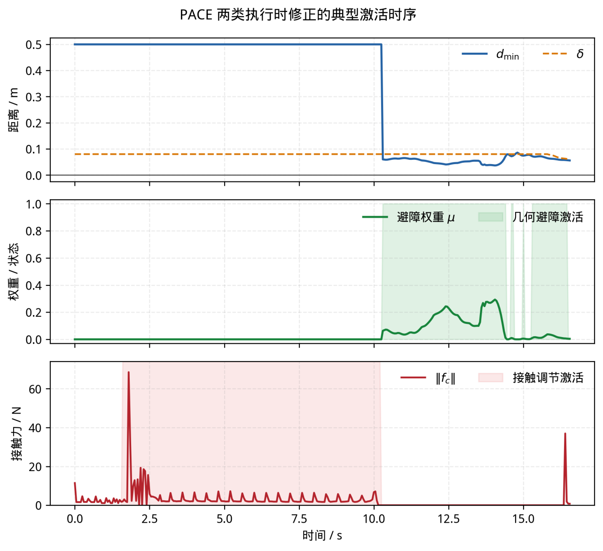
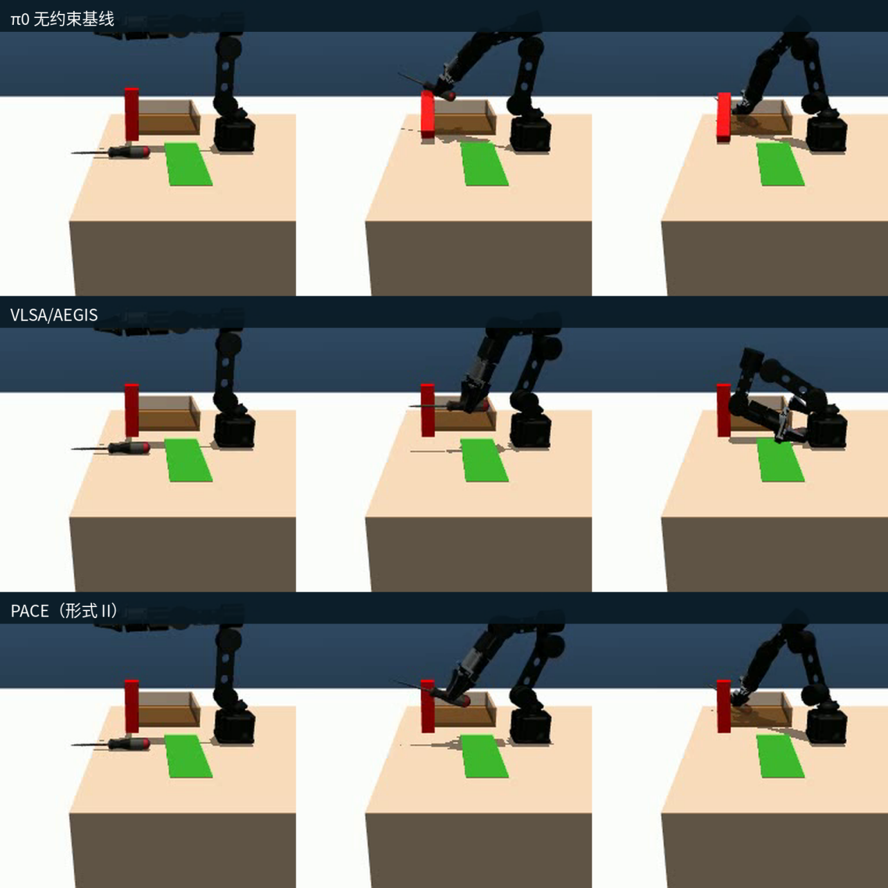
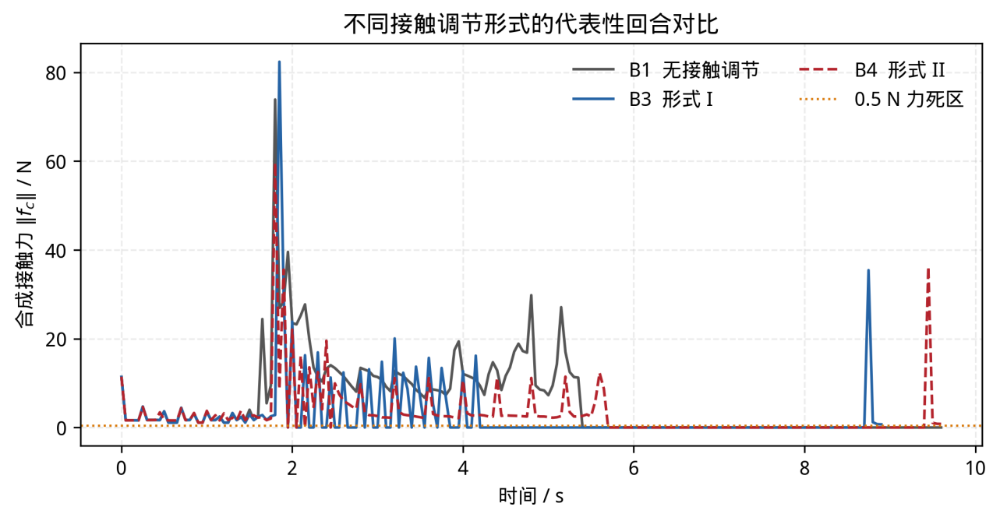
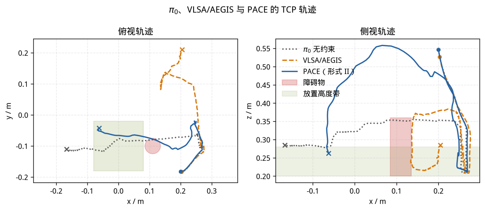

<!-- 修订于 2026-09-27：由 9.19小论文.docx 转换；方法与表 1、表 2 已更新为 recordings 中的视觉与力估计评测。逐回合来源及重算结果见 assets/9.19_md/recordings_metrics.json。原 DOCX 未修改，图像版本说明见 §5.1。 -->

**PACE: Phase-Aware Constraint Enforcement for Safe Execution of Vision-Language-Action Policies**

于效宇¹，黄之峰¹，何伟俊²

¹电子科技大学中山学院；²广东工业大学

通讯作者：\_\_\_\_\_\_\_\_；E-mail：\_\_\_\_\_\_\_\_

# 摘要

视觉-语言-动作（Vision-Language-Action，VLA）模型能够生成复杂操作动作，但通常不显式约束碰撞距离和接触载荷。针对拾放任务中避障与必要接触并存的需求，本文提出阶段感知约束执行框架 PACE，在冻结基础策略的前提下设置几何避障与接触调节两个保护层。几何层通过 GroundingDINO 和 RGB-D 定位已知尺寸的障碍物，以胶囊体距离、分离方向及目标邻近状态修正危险运动；接触层由关节力矩残差估计 TCP 等效外力，通过负载相关增益或惯性—回正递推生成各向异性顺应增量。两层依据可观测风险状态介入，经阻尼最小二乘映射形成执行修正。

MuJoCo 固定初始位置评测表明，几何层降低了碰倒率的点估计，接触层减小了累计接触载荷；完整 PACE 在保留较高任务完成率的同时仍存在峰值冲击。与 VLSA 的系统级比较呈现出任务完成、几何分离和接触载荷之间的不同取舍，不用于排除输入差异后判断控制算法优劣。结果支持按风险类型分别组织执行保护，而非用单一距离条件覆盖整个接触型任务。

关键词：视觉—语言—动作模型；机器人安全；执行时约束；几何避障；接触顺应

# 1 引言

视觉-语言-动作（Vision-Language-Action，VLA）模型将视觉观测、语言指令和机器人动作纳入同一策略，为机器人执行多种操作任务提供了一条端到端路径。RT-2[1]、OpenVLA[2]、Octo[3] 和 π0[4] 等工作不断拓展模型的多任务操作和指令泛化能力。其中，π0 通过流匹配动作专家生成连续动作，能够为复杂操作提供较为平滑的动作序列。

VLA 通常围绕任务完成和动作模仿进行训练，机械臂与障碍物之间应保留多大间隔、接触瞬间应承受多大载荷，并不一定包含在模型的显式约束中。当场景偏离训练分布或临时出现障碍物时，策略仍可能继续朝目标运动，由此引发碰撞或过大的接触冲击，损伤末端工具、被操作物体甚至机器人本体[5,6]。

推理阶段方法在策略输出与执行器之间增加独立安全层，无需重新设计 VLA 的动作生成流程，因而更便于接入已有模型（相关研究详见第 2 节）。本文选取 VLSA[6] 的插件式安全层 AEGIS 作为对比方法，后文将其完整执行链路简称为 VLSA。

对于抓取—放置操作，单纯用几何间隔描述安全仍不够。机械臂搬运已抓取物体时，最近距离能够直接反映其与环境发生干涉的风险；进入下抓阶段后，末端必须接近并接触支撑面，若仍要求始终保持非接触距离，安全约束反而会妨碍任务完成。此时真正需要限制的是接触力峰值和累积冲量。因此，同一任务中实际上存在空间碰撞与接触冲击两类不同风险，二者不宜由一套距离约束统一处理。

两类风险的判断依据和调节对象也不同：空间干涉可通过视觉定位得到的障碍几何和最近距离判断，接触冲击则需要结合末端状态与估计外力进行调节。基于这一差异，本文不让单一约束贯穿整个动作过程，而是根据当前可观测状态启用相应的保护层。

据此，本文提出面向现有 VLA 策略的插件式执行约束框架 PACE（Phase-Aware Constraint Enforcement）。PACE 保留 π0 给出的关节目标，只在检测到风险时作局部修正。框架由几何避障保护层和接触调节保护层组成，两者分别处理不同问题：几何避障保护层根据胶囊体最近距离和分离法向去除危险运动分量，并在末端接近放置目标时缩小安全裕度，避免约束妨碍最终放置；接触调节保护层则在末端进入支撑面邻域后，根据关节力矩残差估计的外力施加各向异性顺应修正。本文为接触调节设计了负载相关增益映射和惯性—回正离散递推两种实现。两类修正均采用闭式计算，并通过阻尼最小二乘（DLS）逆映射转换到关节空间，因此不需要修改基础 VLA 的内部结构。

没有检测到相应风险时，保护层不产生修正，或将已有修正平滑释放，执行指令随之回到基础 VLA 输出。换言之，PACE 不负责替代 VLA 规划任务，只负责在执行端处理局部物理风险。

本文的主要贡献如下：

（1）提出面向转运阶段空间干涉的局部几何避障方法。该方法将 GroundingDINO 与 RGB-D 定位得到的障碍物转换为胶囊体，与机械臂远端、被抓取工具采用统一几何表示，通过最近表面距离和分离法向去除危险运动分量，并结合目标邻近状态连续调节安全裕度、干预权重和有界规避增量，在抑制碰撞风险的同时避免固定距离约束阻碍最终放置。

（2）提出面向接触阶段载荷风险的各向异性顺应调节方法。该方法由关节执行力矩和动力学模型估计等效外力，结合 TCP 高度判断接触风险，分别以负载相关增益映射和惯性—回正离散递推生成单步顺应增量，并将其作用于几何避障保护层输出的动作目标，以抑制支撑面附近的接触冲击。

（3）在 MuJoCo 螺丝刀拾放任务中建立包含 12 种配置的消融评测，系统检验几何避障、两种接触调节形式及其组合效果，并与迁移到同一仿真场景的 VLSA 完整执行链路进行描述性比较。实验从任务完成、障碍物风险、接触载荷和执行负载多个维度揭示了不同安全配置之间的取舍。

# 2 相关工作

视觉-语言-动作模型：VLA 将视觉观测和自然语言指令直接映射为机器人动作。RT-2[1]、OpenVLA[2] 与 Octo[3] 分别从大规模视觉语言预训练、开放模型和通用策略学习等方向推进了这一研究路线；π0[4] 使用流匹配动作专家生成连续动作，π0.5[7] 又进一步拓展到开放世界场景。本文选择 π0 作为基础策略，使用其连续动作输出驱动机器人，并在外部执行链中加入物理安全修正，不介入模型内部的动作生成过程。

VLA 安全增强：现有方法大致分为训练阶段安全增强和执行阶段安全约束两类[8]。前者通过安全数据、奖励或约束目标改变策略的学习过程，例如 SafeVLA[9] 将安全要求纳入模型优化。这种做法能够直接影响策略的动作分布，但也意味着需要重新训练或适配模型。执行阶段方法则在 VLA 输出之后处理动作，可以保留原有的视觉、语言和动作生成流程。PACE 采用后一种思路，研究重点不是重新训练 VLA，而是如何在动作真正执行之前对其作必要修正。

几何安全约束：控制屏障函数（CBF）通过定义安全集并对控制输入施加不等式约束，为机器人避碰提供了较为系统的处理方式[10,11,12]。VLSA[6] 通过 AEGIS 将其接入 VLA 推理链路：视觉语言模块识别障碍物并恢复几何信息，CBF-QP 再以尽量小的改动修正 VLA 动作。这类安全层适合保持障碍间隔，却可能在下抓时与接近支撑面的任务目标冲突。PACE 同样位于执行端，但通过胶囊体距离、运动增量投影和有界规避分量作局部修正，并在接近放置目标时逐步减小干预。

能量引导与反应式避障：OmniGuide[13] 把避障和语义定位等要求写成可微能量场，再借助可微运动学将引导梯度作用到生成轨迹上。经典人工势场方法[14] 使用吸引场和排斥场实现实时避障，但存在局部极小、振荡以及目标邻近障碍物时的 GNRON 问题[15,16]。本文不重新规划整条轨迹，而把 VLA 已生成的动作看作任务意图，只在局部风险区域有限度地改变运动方向。为此，几何模块在远离目标时保留足够的避障作用，接近放置区域后则通过状态相关安全裕度和目标衰减权重逐步释放修正。

力感知与顺应操作：随着 VLA 被用于更多接触丰富型任务，力和力矩反馈也开始进入策略建模。ForceVLA[17]、TA-VLA[18] 与 FD-VLA[19] 分别利用力感知混合专家、扭矩信息和力信息蒸馏增强模型对物理交互的表征，但都需要相应的训练或适配。CompliantVLA-adaptor[20] 采用外部适配器，结合视觉语言任务语境与实时力/力矩反馈调节刚度和阻尼。PACE 也在执行端进行顺应调节，不过它以关节力矩残差估计的外力构造各向异性的单步运动增量，因此可以与冻结的基础策略组合。接触调节保护层负责接触风险，几何避障保护层负责空间干涉，两者共同组成 PACE 的执行约束。

本文聚焦抓取—放置中并存的空间干涉与接触冲击。与 VLSA 相比，PACE 在几何分离之外单独调节接触载荷；与 OmniGuide 相比，它不以能量梯度引导整段轨迹，而在执行端局部修正已有动作；与 CompliantVLA-adaptor 相比，它同时覆盖障碍干涉和接触载荷，并可接入冻结的基础策略。基于这些差异，PACE 以几何避障和接触调节两个保护层分别处理对应风险，同时保留基础 VLA 的视觉—语言理解和动作生成能力。

# 3 问题建模

系统与任务：实验对象为一台带平行夹爪的 6 自由度机械臂，关节目标由位置控制器跟踪。机器人根据外部相机图像、腕部相机图像、本体状态和语言指令，执行“抓取螺丝刀并放入储物盒”的任务。加入障碍物后，支柱位于螺丝刀与储物盒之间，VLA 原本生成的转运轨迹可能与其发生碰撞。

基础策略：π0 根据当前多模态观测输出长度为 $H$ 的动作块，其中前六维为绝对关节目标，夹爪维度用于控制开合。对任一动作 $a$，其相对于当前关节状态 $q$ 的差值定义为

$$
\Delta q^{vla} = a_{1:6} - q
\tag{1}
$$

式（1）给出了本文使用的 VLA 单步关节位移 $\Delta q^{vla}$。PACE 保留 π0 的视觉、语言和动作生成过程，只在动作送入位置控制器之前进行修正。

安全对象：本文考虑两类物理风险。第一类是机械臂远端及被抓取工具与环境障碍物之间的空间干涉，用胶囊体最小表面距离 $d_{min}$ 描述；第二类是末端接近支撑面并建立接触时产生的冲击，用合成接触力峰值及其时间积分（接触冲量）描述。系统根据可观测状态分别判断两类风险，不为整个任务预先指定统一的阶段标签或距离约束。

目标：PACE 的目标是在尽量保留 VLA 原始任务意图的前提下，降低障碍干涉和接触冲击。它只在检测到相应风险时生成附加修正；风险消失后，修正量立即回到零或平滑衰减至零，系统重新直接执行基础策略的动作。

# 4 方法：PACE

## 4.1 概述

PACE 接在基础 VLA 的动作输出之后，由几何避障保护层和接触调节保护层组成。几何避障保护层根据胶囊体最近距离与分离法向修正可能引起障碍干涉的运动分量；接触调节保护层则根据 TCP 高度和估计外力，调节末端的单步接近增量与顺应运动。两个保护层分别面向空间干涉和接触载荷风险，并以同一份 VLA 动作为参考。

这里的“阶段感知（Phase-Aware）”并不是预先把任务划分为抓取、转运和放置等离散阶段，也不需要额外训练阶段分类器。本文所说的“阶段”是约束需求随执行状态变化而形成的功能阶段，而不是预先给定的任务标签：工具或 TCP 高度、障碍物最小距离和接触力共同决定当前需要几何约束、接触约束还是直接执行基础动作。因此，同一个基础策略进入自由空间、障碍物邻域和接触邻域时，会得到不同的执行保护；相应风险消失后，修正随即置零或平滑释放。

具体来说，工具尚未抬升，或障碍物仍在安全裕度之外时，几何避障保护层不工作；工具抬升后，一旦最小距离进入安全裕度，几何修正开始介入。TCP 低于接触激活高度后，接触调节保护层进入工作区；TCP 低于支撑面参考高度且命令仍向下时，该保护层截断中间笛卡尔增量的法向分量，接触力超过死区后再叠加力相关顺应增量。条件不再满足时，几何修正直接归零，接触顺应状态按释放系数逐步衰减。这种由可观测条件触发相应保护层的方式，就是本文所说的阶段感知。

两类修正都先在笛卡尔空间中计算，再通过阻尼最小二乘（DLS）逆映射到关节空间。几何避障保护层首先根据障碍物距离和分离法向修正动作目标，接触调节保护层随后根据当前关节状态和接触力作进一步修正。两层分别处理空间干涉和接触载荷风险，并依据各自的触发条件介入；没有对应风险时，系统保持或恢复基础 VLA 的动作输出。由于风险判断与修正都发生在模型输出之后，PACE 无需重写基础 VLA 的动作生成算法。本文所称“约束执行”是指对基础动作施加有界修正，并不构成对离散闭环系统硬安全性的理论保证。

图 1 给出了 PACE 的总体执行框架以及两个保护层在动作执行链中的位置，第 4.2 节和第 4.3 节分别介绍接触调节保护层和几何避障保护层的具体计算。

图 1 PACE 总体框架图。图内原有双层结构保留；当前几何输入为 GroundingDINO 与 RGB-D 定位结果，力反馈输入为关节力矩残差估计结果。

## 4.2 接触调节保护层

接触调节保护层在 TCP 进入支撑面邻域后参与执行，利用估计外力调节单步运动增量。当前实现不再把 MuJoCo 接触求解器给出的力直接送入控制器，而是从关节执行力矩、速度反馈和动力学模型构造关节力矩残差，再估计环境作用于机器人的 TCP 等效外力。力估计负责提供反馈，后续两种顺应调节形式保持不变。

令 $j$ 表示一次物理积分步，$v^{(j)}$ 为积分前的系统广义速度，$\Delta t_s$ 为积分步长。式（2a）由相邻速度差得到平均加速度；式（2b）扣除已知驱动力和被动力，提取六个机械臂关节上的外力矩残差：

$$
\bar a^{(j)}=\frac{v^{(j+1)}-v^{(j)}}{\Delta t_s}.
\tag{2a}
$$

$$
r_\tau^{(j)}
=S_a\!\left[\bigl(\mathcal M^{(j)}+\Delta t_s D\bigr)\bar a^{(j)}
+b^{(j)}-p^{(j)}\right]-\tau_m^{(j)}.
\tag{2b}
$$

其中，$\mathcal M$ 为完整系统惯性矩阵，$b$ 为重力、科氏力和离心力等偏置项，$p$ 为已计入模型的被动力，$S_a$ 选取六个机械臂关节对应的行，$\tau_m$ 为这些关节的执行力矩反馈。仿真中 $\tau_m$ 取自 qfrc_actuator，并非额外安装的力矩传感器读数。计算先使用完整惯性矩阵，再选取机械臂关节分量，以保留夹爪运动的惯性耦合。$D$ 为 MuJoCo 关节黏性阻尼对角矩阵，$\Delta t_sD\bar a$ 用于补偿当前 Euler 积分器的隐式阻尼处理；关闭该处理时不加入此项。该式描述的是当前仿真适配器，不应直接套用于其他积分器。

记 $J_{tcp}^{(j)}\in\mathbb R^{3\times6}$ 为世界坐标系下的 TCP 平移雅可比。式（2c）通过带正则项的最小二乘关系 $J_{tcp}^{\mathsf T}f\approx r_\tau$，得到三维原始外力估计：

$$
f_{\mathrm{raw}}^{(j)}
=\left[J_{tcp}^{(j)}J_{tcp}^{\mathsf T,(j)}+\rho_F^2I_3\right]^{-1}
J_{tcp}^{(j)}r_\tau^{(j)}.
\tag{2c}
$$

其中，$\rho_F$ 为力估计的正则化系数，与动作修正使用的 DLS 阻尼参数不同。这里估计的是能够解释关节力矩残差的 TCP 等效外力，并不意味着所有真实接触都发生在 TCP；多点接触、接触力矩以及未建模摩擦和关节限位也可能进入残差。

为减弱速度差分引入的波动，式（2d）以截止频率 $\nu_F$ 对原始外力进行低通滤波；式（2e）再施加径向软死区 $d_F$ 和模长上限 $F_{\max}$：

$$
\bar f^{(j)}=(1-\alpha_F)\bar f^{(j-1)}+\alpha_F f_{\mathrm{raw}}^{(j)},
\qquad \alpha_F=1-\exp(-2\pi\nu_F\Delta t_s).
\tag{2d}
$$

$$
f_e^{(j)}=
\begin{cases}
\displaystyle\frac{\min\{\max(\|\bar f^{(j)}\|-d_F,0),F_{\max}\}}{\|\bar f^{(j)}\|}\bar f^{(j)}, & \|\bar f^{(j)}\|>0,\\
0, & \|\bar f^{(j)}\|=0.
\end{cases}
\tag{2e}
$$

式（2f）用不同的进入阈值 $F_{\mathrm{on}}$ 和退出阈值 $F_{\mathrm{off}}$ 更新接触估计状态 $c^{(j)}$，以减少阈值附近的反复切换：

$$
c^{(j)}=
\begin{cases}
\mathbf 1[\|f_e^{(j)}\|\ge F_{\mathrm{on}}], & c^{(j-1)}=0,\\
\mathbf 1[\|f_e^{(j)}\|>F_{\mathrm{off}}], & c^{(j-1)}=1.
\end{cases}
\tag{2f}
$$

其中，$\mathbf 1[\cdot]$ 为示性函数，$F_{\mathrm{off}}<F_{\mathrm{on}}$，每回合开始时滤波状态和接触状态均清零。观测器在一次物理积分完成后更新，所得估计供下一子步使用。因而，式（2g）给出第 $j$ 个子步实际送入顺应控制器的反馈力：

$$
f_c^{(j)}=c^{(j-1)}f_e^{(j-1)}.
\tag{2g}
$$

这一反馈具有一个物理子步的因果延迟。$c^{(j)}$ 只判断估计力是否足以进入反馈链路，并不替代 TCP 高度触发条件；后者仍决定接触调节保护层是否参与执行。以下省略无需强调的子步上标。

式（3a）使用力死区 $f_{d}$ 得到有效载荷 $e_{f}$；式（3b）根据加权接触力构造顺应方向 $n_{f}$；式（3c）定义切向权重矩阵 $W$：

$$
e_{f} = \max\left( \left\| f_{c} \right\| - f_{d},0 \right)
\tag{3a}
$$

$$
n_{f} = \frac{Wf_{c}}{\left\| Wf_{c} \right\| + \varepsilon}
\tag{3b}
$$

$$
W = diag(w_{t},w_{t},1)
\tag{3c}
$$

其中，$w_{t} < 1$ 用于减弱水平切向分量，$f_d$ 是控制器的载荷死区，与观测器的软死区 $d_F$ 分别作用于反馈链路的不同位置。$f_c$ 的符号约定为环境作用于机器人的外力，估计过程中不按竖直分量正负翻转向量。在本文水平桌面接触工况中，支撑反力通常沿世界坐标系的正 $z$ 方向，因此沿 $+n_f$ 叠加顺应增量使末端趋于卸载。式（3a）—式（3c）保留这一力方向，同时减弱切向干预；它们并不保证任意接触下的估计力都指向离开桌面，也不直接适用于任意朝向的支撑面。

得到有效载荷与顺应方向后，本文比较两种离散顺应实现。基础策略输出的是绝对关节目标，因此雅可比映射后的量在这里不解释为连续时间速度，而是每次控制更新对应的单步笛卡尔运动增量，记为 $\xi$。形式 I 使用负载相关增益，将力误差直接映射为顺应增量，并用低通滤波抑制突变；形式 II 使用由惯性参数和回正参数决定的一阶离散递推，逐步更新顺应增量。两种形式采用相同的单步增量上限，主要区别在于修正建立的速度和平滑程度。

形式 I 的计算过程如式（4a）—式（4c）所示：式（4a）根据接触力模长调整力—位移增益 $K_{f}$，式（4b）生成并限幅理想顺应增量，式（4c）通过低通滤波得到最终修正量：

$$
K_{f} = k_{0} + k_{1}\left\| f_{c} \right\|
\tag{4a}
$$

$$
\xi_{id} = {sat}_{\xi_{\max}}\left( K_{f}e_{f}n_{f} \right)
\tag{4b}
$$

$$
\xi_{c}^{I} = {LPF}_{\alpha}\left( \xi_{id} \right)
\tag{4c}
$$

形式 II 首先按照式（5a）对接触力进行指数滤波，再按照式（5b）更新带有回正项的单步顺应增量：

$$
{\widehat{f}}_{c}^{(j)} = \lambda f_{c}^{(j)} + (1 - \lambda){\widehat{f}}_{c}^{(j - 1)}
\tag{5a}
$$

$$
\xi_{c}^{II,(j + 1)} = {sat}_{\xi_{\max}}\left\lbrack \left( 1 - \frac{B\Delta t_{s}}{M} \right)\xi_{c}^{II,(j)} + \frac{\Delta t_{s}}{M}{\widehat{e}}_{f}^{(j)}{\widehat{n}}_{f}^{(j)} \right\rbrack
\tag{5b}
$$

形式 II 中，$j$ 表示低层物理子步，$\Delta t_{s}$ 为子步时间，滤波后的有效载荷为 ${\widehat{e}}_{f}^{(j)} = \max(\left\| {\widehat{f}}_{c}^{(j)} \right\| - f_{d},0)$，对应的顺应方向为 ${\widehat{n}}_{f}^{(j)} = W{\widehat{f}}_{c}^{(j)}/(\left\| W{\widehat{f}}_{c}^{(j)} \right\| + \varepsilon)$。式（5b）与实现中的递推更新严格等价，其中 $\xi_{c}^{II}$ 始终表示单步笛卡尔修正量而非连续时间速度；$M$ 与 $B$ 分别为位移状态递推的等效惯性参数和回正参数，使 $\Delta t_{s}/M$ 的量纲为 m/N、$B\Delta t_{s}/M$ 为无量纲。二者均为离散控制递推参数，不对应机械臂或负载的真实物理质量与阻尼。若 TCP 已低于支撑面参考高度且目标运动增量仍指向支撑面，则将该法向增量截断为零，以限制继续向下运动。离开接触邻域后，顺应状态按固定衰减系数平滑释放，避免控制量突变。

代码在每个低层子步中先计算固定几何目标相对当前关节状态的剩余位移，再将其映射为 TCP 单步运动增量。记第 $j$ 个子步的当前关节状态为 $q^{(j)}$，几何模块在本动作周期给出的固定目标为 $u_{geo}$，原始笛卡尔增量为 $\xi_{raw}^{(j)} = J_{tcp}^{(j)}(u_{geo} - q^{(j)})$。代码随后根据 TCP 到支撑面的距离对其竖直分量作缩放，记所得中间量为 $\xi_{cmd}^{(j)} = B_{z}(\xi_{raw}^{(j)})$；若 TCP 已低于支撑面参考高度，则算子 $T_{z}( \cdot )$ 将其中仍指向支撑面的法向分量截断为零。根据所选接触形式，令 $\xi_{c}^{(j)} = \xi_{c}^{I,(j)}$ 或 $\xi_{c}^{II,(j)}$，于是 $\xi_{tgt}^{(j)} = T_{z}(\xi_{cmd}^{(j)}) + \xi_{c}^{(j)}$。式（6）将目标增量与中间命令增量之差通过 TCP 平移雅可比的阻尼最小二乘逆映射到关节空间：

$$
\Delta q_{con}^{(j)} = J_{tcp,\rho}^{\dagger ,(j)}\left( \xi_{tgt}^{(j)} - \xi_{cmd}^{(j)} \right)
\tag{6}
$$

其中，$J_{tcp,\rho}^{\dagger ,(j)}$ 为第 $j$ 个子步 TCP 平移雅可比的带阻尼伪逆。式（6）只把法向截断与顺应造成的笛卡尔增量差映射回关节空间；完整执行命令将在第 4.4 节结合几何目标统一给出。

## 4.3 几何避障保护层

几何避障保护层主要处理转运过程中机械臂远端或被抓取工具与障碍物发生干涉的问题。当前 PACE 通过 GroundingDINO[21] 与 RGB-D 图像定位障碍支柱，再将其转换为避障所需的胶囊体，不再从仿真障碍物刚体状态直接生成控制用几何。

每回合复位后，系统先推进物理仿真等待支柱落稳，再暂停物理步进，获取外部相机 rear_cam 的 640×480 RGB 图像和深度图。GroundingDINO 使用固定文本 red pillar. 检测候选区域，并按照相机内外参将区域内的有效深度反投影至世界坐标系。检测器只提供二维候选框，三维几何还需由深度和场景先验共同确定。

当前定位器针对尺寸为 0.04×0.04×0.16 m、直立且与世界坐标轴对齐的静止支柱。它在已知桌面高度基础上筛选柱顶附近的点云连通区域，检查顶面宽度与可见高度是否充分，再由顶面横向范围估计中心坐标 $(\hat x_o,\hat y_o)$。障碍胶囊轴线端点取为 $p_o^-=(\hat x_o,\hat y_o,z_T)$ 和 $p_o^+=(\hat x_o,\hat y_o,z_T+h_o)$，其中 $z_T=0.20$ m 为桌面高度，$h_o=0.16$ m 为支柱高度。胶囊半径取横截面外接圆半径加几何余量，即 $r_o=\sqrt{2}\times0.02+0.01\approx0.0383$ m。这是结合已知尺寸的视觉定位，不是对任意障碍物形状的重建。

定位成功后，障碍胶囊在本回合内缓存使用，不持续跟踪柱体运动。若未检测到目标、可见几何不足，或存在多个无法消歧的有效目标，程序保存感知证据并在执行策略动作前停止，不回退到仿真真值。该流程替换了几何避障的障碍输入，后续的距离计算、风险触发与动作修正保持原有结构。

为了避免在控制循环中反复计算网格距离，本文同样用胶囊体近似腕部远端和螺丝刀。工具抬升后，该保护层计算各活动胶囊与视觉障碍胶囊轴线之间的最近点，并找出表面距离最小的一对几何体。式（7）用轴线最近点距离减去双方半径，得到胶囊体最小表面距离；式（8）给出该几何对的单位分离方向：

$$
d_{\min} = \min_{i}\left( \left\| c_{i}^{\star} - c_{o}^{\star} \right\| - r_{i} - r_{o} \right)
\tag{7}
$$

$$
n = \frac{c_{i}^{\star} - c_{o}^{\star}}{\left\| c_{i}^{\star} - c_{o}^{\star} \right\|}.
\tag{8}
$$

其中，$c_{i}^{\star}$ 与 $c_{o}^{\star}$ 分别为第 $i$ 个活动胶囊轴线与障碍胶囊轴线上的最近点，$r_{i}$ 和 $r_{o}$ 为二者半径；主导几何对即取得最小表面距离的一对胶囊，$n$ 指向远离障碍物的分离方向。被抓取工具在夹爪闭合且位于 TCP 邻域内时加入活动胶囊集合，使细长工具带来的额外扫掠体积能够进入避障判断。

如果放置目标本身靠近障碍物，固定安全距离可能使机械臂迟迟无法到达目标。为减轻这种干预，本文根据 TCP 到放置目标的距离 $\rho$ 调整安全裕度 $\delta$。如式（9）所示，$\delta$ 随 $\rho$ 线性变化，同时受给定上下界限制：

$$
\delta = clip\left( \delta_{0} + \kappa\rho,\delta_{\min},\delta_{\max} \right)
\tag{9}
$$

在安全裕度基础上，式（10a）将总激活权重 $\mu$ 分解为障碍接近因子 $\mu_{d}$、目标邻域衰减因子 $\mu_{g}$ 和回合初始渐入因子 $\mu_{s}$；式（10b）—式（10d）分别给出三个因子的计算方式，从而编码距离风险、目标接近程度与回合开始后的渐入过程。其中，$k$ 为当前回合的动作更新计数，$K_{0}$ 为渐入长度：

$$
\mu = \mu_{d}\mu_{g}\mu_{s}
\tag{10a}
$$

$$
\mu_{d} = \left\lbrack \frac{\delta - \max(d_{\min},0)}{\delta} \right\rbrack^{2}
\tag{10b}
$$

$$
\mu_{g} = clip\left( \frac{\rho - \rho_{0}}{\Delta\rho},0,1 \right)
\tag{10c}
$$

$$
\mu_{s} = clip\left( \frac{k}{K_{0}},0,1 \right),\quad\quad d_{\min} < \delta
\tag{10d}
$$

当 $d_{min} \geq \delta$ 时，令 $\mu = 0$。

按照这一设计，机械臂远离放置目标时保留较大的安全裕度；接近目标后，安全裕度逐渐收缩到预设下界，干预权重也随之减弱。当 $\mu$ 小于设定阈值时，模块不再施加修正，以免微小调整不断累积。

避障修正直接作用于 VLA 输出对应的单步笛卡尔运动增量。记 $J_{b} \in \mathbb{R}^{3 \times 6}$ 为主导活动胶囊所属机器人刚体的平移雅可比，则 $\xi_{vla} = J_{b}\Delta q_{vla}$。如式（11）所示，首先移除其中指向障碍物的法向分量；随后按照式（12）叠加由权重 $\mu$ 调节的抬升、向内回缩和径向分离增量：

$$
\xi_{proj} = \xi_{vla} - \min\left( \xi_{vla}^{\mathsf{T}}n,0 \right)n
\tag{11}
$$

$$
\xi_{safe} = \xi_{proj} + \mu\left( w_{u}{\widehat{e}}_{up} + w_{r}{\widehat{e}}_{in} + w_{n}n \right).
\tag{12}
$$

其中，${\widehat{e}}_{up}$ 与 ${\widehat{e}}_{in}$ 分别表示经过非接近投影后的竖直抬升单位方向和指向机器人基座内侧的回缩单位方向。这种设计不重新规划完整路径，而是在保留 VLA 原始运动趋势的基础上对局部危险运动进行偏转。式（4b）和式（5b）中的 ${sat}_{\xi_{max}}$ 按向量范数进行饱和，式（16）中的 $sat( \cdot , \pm \Delta_{max})$ 则对应代码中的逐关节截断。

笛卡尔修正同样经 DLS 逆映射到关节空间。如式（13）所示，安全增量与原始增量之差被转换为关节空间避障修正；式（14）将其与 VLA 输出合成为候选关节位移，式（15）对候选位移进行一阶平滑，其中 $\Delta q^{-}$ 表示上一次动作更新保存的平滑位移；式（16）完成逐关节单步限幅并生成几何模块目标 $u_{geo}$：

$$
\Delta q_{avo} = J_{b,\rho}^{\dagger}\left( \xi_{safe} - \xi_{vla} \right)
\tag{13}
$$

$$
\Delta q_{c} = \Delta q_{vla} + \Delta q_{avo}
\tag{14}
$$

$$
\Delta q = \beta\Delta q_{c} + (1 - \beta)\Delta q^{-}
\tag{15}
$$

$$
u_{geo} = q + sat\left( \Delta q, \pm \Delta_{\max} \right).
\tag{16}
$$

当障碍物未启用、工具尚未进入转运状态或 $d_{min}$ 不小于当前安全裕度时，$\Delta q_{avo}$ 为零，模块不改变基础策略的运动意图。

## 4.4 双层组合与风险触发特性

接触调节保护层与几何避障保护层均以同一份 VLA 动作为参考，但二者并非将未经处理的修正量直接相加。几何避障保护层首先生成关节目标 $u_{geo}$，接触调节保护层随后根据执行过程中的当前关节状态和接触力对该目标作进一步修正。因此，两层在风险对象上相互独立，在动作执行上形成“几何修正在前、接触修正在后”的串行关系。当前任务中空间干涉和接触载荷风险通常出现在不同执行区间，因此无需另外设置离散的优先级切换器。

结合式（6）与式（16），第 $j$ 个物理子步实际送入位置控制器的 6 维关节目标如式（17）所示。夹爪两维命令不经过 PACE，仍采用 π0 的开合输出：

$$
u_{1:6}^{(j)} = q^{(j)} + \left( u_{geo} - q^{(j)} \right) + \Delta q_{con}^{(j)} = u_{geo} + \Delta q_{con}^{(j)}.
\tag{17}
$$

式（17）对应代码中的真实执行顺序：几何避障保护层的平滑与逐关节限幅先作用于动作级目标，接触调节保护层再根据当前子步状态追加 DLS 修正。因此，完整 PACE 并不是把两个未经处理的关节修正同时叠加后再统一限幅。

两类修正都有明确上界：接触顺应增量不超过 $\xi_{max}$，避障关节位移不超过 $\Delta_{max}$；DLS 阻尼用于抑制机械臂接近运动学奇异构型时的修正增益。没有对应风险时，几何修正直接归零，接触调节保护层的内部状态则按释放系数逐步衰减。因而，PACE 只在局部风险出现时改变 VLA 动作。

图 2 PACE 两类执行时修正在单个成功回合中的典型激活时序。上图为最小表面距离 $d_{min}$ 与安全裕度 $\delta$，中图为避障权重 $\mu$ 与几何避障激活状态，下图为合成接触力与接触调节激活状态。阴影区域表示对应模块的激活区间。 本图沿用原稿记录，不对应本轮表格数据。

# 5 实验设置

## 5.1 实验平台与任务

实验使用 MuJoCo[22] 搭建螺丝刀拾放场景，包括 6 自由度机械臂、平行夹爪、工作台、储物盒和可选障碍支柱。本轮评测将螺丝刀初始平面位置固定为 $(0.28,-0.10)$ m，本文结果均来自仿真实验。

图 3 统一初始位置下的典型执行过程。由上至下分别为 π0 无约束基线、VLSA 与 PACE（形式 II：惯性—回正离散递推）；由左至右分别展示初始状态、障碍物邻域内的执行状态和回合结果。图中 π0 对障碍支柱造成明显扰动，VLSA 保持了几何分离但未完成放置，PACE 则在绕开支柱后继续向放置区域运动。该图仅用于说明三种方法的典型行为差异，定量结论以表 1 和表 2 的统计结果为准。 本图沿用原稿记录，不对应本轮表格数据。

基础策略：π0[4] 通过 OpenPI WebSocket 接口提供服务，输入为外部相机与腕部相机的 256×256 RGB 图像、8 维本体状态和语言指令，每次返回长度为 8 的动作块。MuJoCo 时间步长为 0.001 s，每个动作目标执行 50 个物理子步。系统依次执行动作块中的目标，并在动作块用尽后重新查询策略。几何避障保护层随动作目标更新，接触调节保护层则在每个物理子步中根据当前状态进行修正。

当前输入配置：PACE 采用 obstacle_source=groundingdino 和 contact_force_source=joint_torque，分别启用视觉障碍定位与关节力矩残差反馈。感知在每回合初始化时执行一次，力估计在每个物理子步后更新。TCP 高度门控、两种顺应律以及“先几何、后接触”的动作合成顺序均保持不变。回合初始化的稳定等待最多推进 500 个物理步；从第 100 步起，柱体线速度与角速度均低于各自阈值并持续 50 步时提前结束等待。达到上限时现有程序仍进入感知，因此该等待本身不构成严格的稳定性保证。

数据来源：表 1 对应 recordings 中时间戳为 20260923_162502 的 12 组消融记录，PACE 的障碍输入和力反馈分别为 groundingdino 与 joint_torque。表 2 的 π0 和 PACE 行取自同一批记录，VLSA 行取自 20260923_231050 的 perception 评测。所有数值由逐回合数据重新汇总；峰值力统一按成功回合统计，比例区间按实际回合计数计算。图 2—图 5 暂保留原稿轨迹与截图，仅作为旧版本的定性示例，不作为本轮数据的可视化证据。

回合协议：机械臂每回合从零点构型开始，螺丝刀初始平面坐标固定为 $(0.28,-0.10)$ m。12 组消融配置各包含 50 个有效回合，合计 600 回合；VLSA 对比记录也采用相同初始坐标。单回合在任务成功或达到 600 个动作步时终止。本轮检验的是固定场景下重复执行的表现，不用于推断随机位置变化下的泛化能力；相同回合编号也不表示各方法共享策略采样的随机状态。

判定标准：储物盒有效区域在世界坐标系中定义为 $|x + 0.05| < 0.12$ m、$|y| < 0.12$ m 且 $z < 0.34$ m。螺丝刀进入该区域并完成释放，且上述状态连续保持 5 个动作步时记为任务成功；未在 600 个动作步内满足该条件的回合记为失败。释放状态由夹爪打开指令大于 0.02，或 TCP 与螺丝刀中心距离大于 0.06 m 判定。障碍物碰倒率 CR 仅表示支柱被碰倒的回合比例，而非任意接触事件的发生率；当支柱局部 $z$ 轴在世界坐标系中的竖直分量 $R_{zz} < 0.9$，即支柱相对竖直方向的倾角超过约 25.8° 时，将该回合记为障碍物碰倒。

## 5.2 消融实验设计

消融实验分别控制障碍物、几何避障和接触调节三个因素。B1–B6 不设置障碍物，B7–B12 设置障碍物。两种工况都包含基础策略、仅启用几何避障、分别启用接触调节形式 I 或形式 II，以及将几何避障与两种接触形式组合起来的配置，共 12 组，每组运行 50 回合。B11 和 B12 都属于完整 PACE，仅接触调节的实现形式不同。

结果分析采用单因素对照。比较几何避障时保持接触调节配置不变；比较接触调节时，则保持障碍物条件和几何避障配置不变。

## 5.3 VLSA 对比基线

外部对比采用 VLSA[6] 的插件式安全层 AEGIS，将视觉语言识别、几何感知和安全控制流程迁移到本文的 MuJoCo 螺丝刀拾放环境。表 2 使用同一 π0 基础策略、场景、固定初始位置及成功与碰倒判据。预备验证时，GLM-4.5V 将障碍物命名为 red pillar；本轮记录采用 perception 模式并固定文本 red pillar.，GroundingDINO 从两个 RGB 视角定位候选区域，深度点云经裁剪、去噪、聚类和融合后，通过最小体积包围椭球（MVEE）恢复障碍几何。PACE 则采用单视角 RGB-D 定位与已知尺寸胶囊表示。虽然两者都使用 GroundingDINO，其视角、先验与几何表示仍不相同。

语言指令也存在差异：PACE 部署入口使用“Pick up the screwdriver and drop it into the box.”；本轮 VLSA 记录保存的指令为“Pick up the screwdriver, place it inside the box, then open the gripper and leave the screwdriver in the box.”，对释放与留置要求更明确。PACE 回合文件未单独保存指令文本，其描述依据对应部署入口；VLSA 指令可由回合元数据核对。因此，表 2 是两套执行配置的描述性比较，不是严格控制全部输入变量的算法对照。

几何表示：按照 AEGIS 的建模方式，末端执行器与任务相关障碍物均用椭球体近似，并由虚拟单位向量 $z$ 确定末端椭球表面的分离支撑方向。夹爪网格给出的基础末端椭球半轴为 $(0.1046,0.0534,0.1012)$ m，本轮记录使用 0.8 倍缩放，实际半轴约为 $(0.08371,0.04276,0.08096)$ m；障碍物椭球的中心、姿态和半轴则由双视角感知点云的 MVEE 拟合结果确定，而不是在控制中读取 MuJoCo 障碍物真值。由两椭球的分离切平面构造屏障函数 $h$，$h \geq 0$ 表示代理椭球满足分离条件。

全动作 CBF-QP：基础策略输出的绝对关节目标首先转换为一个动作周期内的名义关节速度，再经末端雅可比映射为名义平移与转动速度。QP 的决策变量为 $u = \lbrack v^{\mathsf{T}},\omega^{\mathsf{T}},u_{z}^{\mathsf{T}}\rbrack^{\mathsf{T}} \in \mathbb{R}^{9}$，其中 $u_{z}$ 用于更新虚拟分离方向。如式（18）所示，优化目标是在权重矩阵 $W_{q}$ 下最小化安全动作与参考动作之间的偏差；式（19）给出相应的 CBF 安全约束。本轮还逐轴限制相对名义动作的修正量：平移速度差不超过 0.08 m/s，角速度差不超过 0.08 rad/s：

$$
u^{\star} = \underset{u}{arg\, min}\mspace{6mu}(u - u_{ref})^{\mathsf{T}}W_{q}(u - u_{ref})
\tag{18}
$$

$$
s.t.\quad\quad a_{v}^{\mathsf{T}}(v + \Delta v_{s}) + a_{\omega}^{\mathsf{T}}(\omega + \Delta\omega_{s}) + a_{z}^{\mathsf{T}}u_{z} + \alpha_{h}h \geq 0,
\tag{19}
$$

其中，$u_{ref} = \lbrack v_{nom}^{\mathsf{T}},\omega_{nom}^{\mathsf{T}},(k_{z}\mu_{z})^{\mathsf{T}}\rbrack^{\mathsf{T}}$；$a_{v}$、$a_{\omega}$ 与 $a_{z}$ 为屏障函数对末端平移、转动和辅助状态变化的解析系数，$\mu_{z}$ 为虚拟状态梯度项。$\Delta v_{s} = v_{act} - v_{nom}$ 与 $\Delta\omega_{s} = \omega_{act} - \omega_{nom}$ 是本文针对位置伺服执行链加入的速度补偿：它以 MuJoCo 当前关节速度计算实际末端运动，并令 CBF 约束作用于“实际运动加安全增量”。当实际速度等于名义速度时，式（19）退化为原 AEGIS 的全动作 CBF 约束，因此该项属于仿真接口适配，而不是对基线 QP 目标和椭球屏障结构的重新设计。

QP 由 OSQP 在每个 0.05 s 动作周期求解。得到安全末端速度后，本文仅将其相对名义速度的差值经阻尼最小二乘逆映射回关节空间，具体关节增量适配过程如式（20）所示：

$$
\Delta q_{vlsa} = clip\left\lbrack \left( {\dot{q}}_{nom} + J_{6,\rho}^{\dagger}\begin{bmatrix}
v^{\star} - v_{nom} \\
\omega^{\star} - \omega_{nom}
\end{bmatrix} \right)\Delta t_{a}, - \Delta q_{\max},\Delta q_{\max} \right\rbrack.
\tag{20}
$$

式中，$J_{6,\rho}^{\dagger}$ 为由末端平移与转动雅可比纵向拼接后得到的 6 维阻尼最小二乘逆。位置控制器最终跟踪 $q + \Delta q_{vlsa}$，夹爪命令保持基础策略输出不变。QP 目标权重为 $W_{q} = diag(0.04I_{6},I_{3})$，屏障增益 $\alpha_{h} = 10$，辅助状态增益 $k_{z} = 10$，DLS 阻尼因子 $\rho = 0.05$，单步关节增量上限 $\Delta q_{max} = 0.25$ rad。若 OSQP 未返回最优或近似最优解，则该动作周期回退到名义 VLA 运动，同时记录一次 QP 失败；正式对比不使用仅在拾取后开启约束的诊断门控。上述对比用于考察严格几何分离约束在当前接触型拾放任务中对障碍物风险、任务完成与接触载荷的影响，完整参数列于表 A2。

## 5.4 评价指标

实验从任务完成、障碍物风险和执行载荷三个方面评价各方法。任务与障碍物指标分别为成功率 SR 和碰倒率 CR；接触指标包括平均峰值接触力 $\widehat{f}$、全回合平均接触冲量 $I$、成功回合冲量 $I_{succ}$ 及其标准差 $\sigma_{I}$；执行负载用平均峰值关节扭矩 ${\widehat{\tau}}_{max}$ 描述。$\widehat{f}$ 的计算方式是先取得每个成功回合的接触力模长峰值，再在成功回合之间求平均，用于比较任务完成条件下的接触品质。$I$ 对全部回合的接触力模长时间积分取均值，因而同时包含失败轨迹的接触代价；$I_{succ}$ 和 $\sigma_{I}$ 则只使用成功回合。对于 ${\widehat{\tau}}_{max}$，先求每个回合中 6 个关节执行扭矩绝对值的时间峰值，再对全部回合取平均。SR 和 CR 另给出基于回合计数计算的 Wilson 95% 置信区间。本文使用这些指标作描述性比较，不据此声称统计显著性。

控制反馈与评价真值分开记录。新实现的顺应控制仅接收式（2g）的估计力；用于计算峰值与冲量的接触真值不回流到该控制通道。为保持已有指标口径，任务统计仍沿用原有桌面高度带内的相关接触力筛选与方向处理。同时，观测器另记录环境作用于机器人本体的净接触真值，用于检查估计误差；该真值排除机器人内部接触，不对负竖直分量作翻转。两种评价量的接触集合与合成方式不同，不能与估计力混作同一条曲线，也不能用已限幅的估计力代替真值统计冲击。

# 6 实验结果

本节汇总固定初始位置下的 12 组消融结果及 VLSA 系统级对比。PACE 使用视觉障碍定位和关节力矩残差反馈；实验配置及比较边界见第 5 节。

## 6.1 消融实验结果

表 1 汇总了 12 种消融配置的结果，每组包含 50 个固定初始位置回合。形式 I 为负载相关增益映射，形式 II 为惯性—回正离散递推。无障碍的六组均完成了全部回合，因此这一工况下更有区分度的是接触载荷，而不是成功率。

有障碍时，不启用几何避障的 B7、B9 和 B10 均在每个回合出现了支柱碰倒。启用几何避障后，B8、B11 和 B12 的碰倒率分别降至 10%、12% 和 12%，相应任务成功率的点估计均未下降。几何保护的主要收益体现在抑制支柱扰动，而不能仅靠任务是否完成来判断：无约束基线仍能完成多数回合，却在完成过程中碰倒了障碍物。

表 1：12 种消融配置的主要结果

| **组号** | **障碍物** | **几何避障** | **接触调节** | **SR (%) \[95% CI\]↑** | **CR (%) \[95% CI\]↓** | $\widehat{f}$ **(N)↓** | $I$ **(N·s)↓** |
|:---:|:---:|:----:|:----:|:-------------:|:-------------:|:--------:|:---------:|
| B1 | ✗ | ✗ | — | 100.0 [92.9, 100.0] | — | 71.20 | 40.92 |
| B2 | ✗ | ✓ | — | 100.0 [92.9, 100.0] | — | 76.08 | 57.25 |
| B3 | ✗ | ✗ | I | 100.0 [92.9, 100.0] | — | 70.20 | 5.88 |
| B4 | ✗ | ✗ | II | 100.0 [92.9, 100.0] | — | 79.47 | 6.91 |
| B5 | ✗ | ✓ | I | 100.0 [92.9, 100.0] | — | 76.04 | 14.95 |
| B6 | ✗ | ✓ | II | 100.0 [92.9, 100.0] | — | 78.82 | 9.39 |
| B7 | ✓ | ✗ | — | 84.0 [71.5, 91.7] | 100.0 [92.9, 100.0] | 72.03 | 63.29 |
| B8 | ✓ | ✓ | — | 86.0 [73.8, 93.0] | 10.0 [4.3, 21.4] | 86.41 | 60.30 |
| B9 | ✓ | ✗ | I | 72.0 [58.3, 82.5] | 100.0 [92.9, 100.0] | 75.61 | 18.72 |
| B10 | ✓ | ✗ | II | 66.0 [52.2, 77.6] | 100.0 [92.9, 100.0] | 77.96 | 24.35 |
| B11 | ✓ | ✓ | I | 88.0 [76.2, 94.4] | 12.0 [5.6, 23.8] | 83.08 | 21.85 |
| B12 | ✓ | ✓ | II | 86.0 [73.8, 93.0] | 12.0 [5.6, 23.8] | 85.12 | 18.87 |

注：各组 $n=50$；方括号内为 Wilson 95% 置信区间；无障碍工况不定义 CR。峰值力仅对成功回合求均值，与运行汇总文件中的全回合峰值均值不是同一统计量。

接触调节的作用可先从无障碍且关闭几何避障的 B1、B3、B4 观察。相对于 B1，形式 I 和形式 II 的平均接触冲量分别降低 85.6% 和 83.1%，同时维持了本组全部回合成功。成功回合冲量标准差由 8.27 N·s 降至 0.94 N·s 和 1.50 N·s，说明累计载荷及其回合间波动均有所减小。不过，形式 II 的平均峰值力并未同步下降，因此这里的改善主要体现为累计接触载荷的降低，而不是所有瞬时冲击都被消除。

有障碍时，B11 和 B12 相对于无约束基线 B7 的全回合平均接触冲量分别降低 65.5% 和 70.2%；相对于仅几何避障的 B8，则分别降低 63.8% 和 68.7%。两种完整配置的任务成功率处于相近水平，但不能仅凭少数回合的差异判定优劣。形式 II 的全回合与成功回合冲量更低，平均峰值关节扭矩也小于形式 I；形式 I 的成功回合平均峰值力略低，体现出不同载荷指标之间的取舍。

累计冲量下降并不意味着峰值风险已经解决。B11 和 B12 的全回合平均峰值力分别为 132.96 N 和 167.77 N，高于表 1 中只统计成功回合的数值，说明失败回合仍包含较强的接触冲击。两者的平均峰值关节扭矩为 7.73 N·m 和 7.26 N·m，也高于无约束基线的 5.78 N·m。因此，当前双层保护的证据更适合表述为降低碰倒风险和累计载荷，而不是同时改善全部安全与执行负载指标。

图 4 无障碍条件下不同接触调节形式的成功回合接触力时域对比（B1、B3、B4）。三条曲线采用相同固定初始位置，并分别选取能够成功完成任务的回合，用于比较成功执行过程中的动态接触响应，不参与总体性能统计；定量结论以表 1 的统计结果为准。 本图沿用原稿记录，不对应本轮表格数据。

## 6.2 与 VLSA 的对比

表 2 比较 π0 无约束基线、VLSA 和两种完整 PACE。各行均由 50 个固定初始位置回合汇总，峰值力统一取成功回合均值，冲量和扭矩采用第 5.4 节的相同统计口径。几何感知方式与语言指令的差异见第 5.3 节，因此这里只讨论完整执行配置呈现的结果。

表 2：外部方法综合对比

| **方法** | **SR (%) \[95% CI\]↑** | **CR (%) \[95% CI\]↓** | $\widehat{f}$ **(N)↓** | $I$ **(N·s)↓** | $I_{succ}$ **(N·s)↓** | ${\widehat{\tau}}_{max}$ **(N·m)↓** |
|:-----------:|:----------:|:----------:|:-----:|:------:|:-------:|:-------:|
| π0 无约束基线（B7） | 84.0 [71.5, 91.7] | 100.0 [92.9, 100.0] | 72.03 | 63.29 | 23.95 | 5.78 |
| VLSA（固定语义查询）[6] | 70.0 [56.2, 80.9] | 0.0 [0.0, 7.1] | 213.93 | 108.88 | 108.94 | 7.76 |
| PACE（负载增益，B11） | 88.0 [76.2, 94.4] | 12.0 [5.6, 23.8] | 83.08 | 21.85 | 14.13 | 7.73 |
| PACE（惯性—回正递推，B12） | 86.0 [73.8, 93.0] | 12.0 [5.6, 23.8] | 85.12 | 18.87 | 8.57 | 7.26 |

注：各行 $n=50$；方括号内为 Wilson 95% 置信区间；↑ 表示越大越好，↓ 表示越小越好；$\widehat f$ 与 $I_{succ}$ 仅统计成功回合。

VLSA 在本轮记录中未出现支柱碰倒，但成功回合平均峰值力和接触冲量均高于 PACE。几何分离指标与接触载荷指标并不一致，说明避免碰倒不能替代对接触过程的评价。两种 PACE 的任务成功率点估计较高，累计载荷较低，但仍有支柱碰倒，不能据此认定其在所有安全维度上都优于 VLSA。各成功率置信区间存在重叠，加上语言指令和几何输入的差异，本文不作统计显著性或单一算法因果解释。

图 5 π0、VLSA 与 PACE（惯性—回正离散递推）在固定初始位置下的 TCP 轨迹对比：左图为俯视轨迹，右图为侧视轨迹；圆点与交叉分别表示轨迹起点和终点。其中 VLSA 采用仿真真值障碍物几何，以隔离感知误差并展示 CBF-QP 的执行行为。本图用于轨迹形态的定性对比，定量结论以表 2 为准。 本图沿用原稿记录，不对应本轮表格数据。

# 7 讨论与局限

本文迁移的 VLSA 包含 GLM-4.5V、GroundingDINO、双视角 RGB-D 点云重建、MVEE 拟合和 CBF-QP。GLM-4.5V 在预备验证中将障碍物命名为 red pillar；表 2 评测固定该描述，其余感知与控制模块仍在线运行。因此，表 2 反映的是固定语义查询下的执行链路性能，而非逐回合调用 VLM 的端到端性能。

此外，原 AEGIS 的连续时间安全结论以几何准确、代理几何完整外包物体且屏障约束持续满足为前提。本文将其接入 20 Hz 绝对关节目标和位置伺服执行链，并为这一接口加入实测速度补偿，不能直接把原有理论保证照搬到当前离散仿真中。因此，本文只根据实际测得的 SR、CR 和接触载荷评价迁移结果；表 2 中 CR 为 0% 只表示本次实验未出现支柱碰倒，不代表一般意义上的零碰撞保证。

PACE 仍有少量避障失败，原因可能来自几何近似和离散更新。当前实现用胶囊体表示远端连杆、工具和障碍物，并且只在动作更新时重算主导分离方向。机械臂位形变化较快或胶囊包络存在误差时，干涉可能在下一次修正前已经发生。局部动作修正也不能代替基础策略的任务规划：如果 VLA 原始动作明显偏离可行区域，避障只能延缓而未必能够挽回任务；接触修正过强时，也可能造成下抓深度不足或释放延迟。两个保护层短暂同时介入还会改变基础动作的到达时序。后续可以提高几何更新频率、细化多胶囊表示，并进一步研究两个保护层同时工作时的协调方式。

当前规避方向包含向上跨越和向机器人内侧回缩等桌面操作先验，这些经验适合本文的拾放场景，却不能覆盖所有空间结构。面对悬垂障碍、狭窄通道，或障碍物同时影响抓取对齐的情况，固定方向可能反而缩小可行空间。更一般的实现需要根据局部自由空间动态选择规避方向，而不是依赖单一场景经验。

当前实现已将障碍输入改为 GroundingDINO 与 RGB-D 定位，将顺应反馈改为关节力矩残差估计，但这不等同于完成了从仿真到真机的迁移。视觉定位仍依赖已知柱体尺寸、直立姿态、桌面高度和相机标定，并要求较完整的可见顶面；回合内缓存的障碍几何也不能跟随受碰后的位姿变化。除障碍定位外，机器人、工具和目标的部分状态仍由仿真提供，因此不能将当前系统描述为全状态均由视觉恢复。

力估计依赖动力学模型、同步的速度与执行力矩反馈。在仿真中，模型与被控对象相匹配，执行力矩也没有真实电流测量和传动环节的误差；实机上还需处理力矩标定、摩擦、负载变化及速度差分噪声。关节残差映射得到的是 TCP 等效外力，多连杆接触、额外接触力矩和运动学奇异性都可能降低其准确性。当前实现不依赖接触求解器提供控制反馈，但不能据此声称已获得与实物力传感器等价的测量精度。

实验范围同样限制了结论的外推。本轮只在一种机械臂、一项螺丝刀拾放任务、一类支柱以及一个固定初始位置上重复评测，尚不能说明跨位置与跨任务的泛化能力。PACE 使用约 0.0383 m 半径的已知尺寸视觉胶囊，VLSA 使用双视角点云拟合椭球，两者还采用不同的语言指令。因而，消融结果可用于分析同一 PACE 执行配置中的模块作用，外部方法比较则只能作为系统级描述。后续需要统一任务指令、扩展初始状态与障碍布局，并分别检查成功和失败回合中的载荷尾部。

# 8 结论

本文提出 PACE，用于补充 VLA 在执行阶段缺少的物理安全约束。这里的阶段指约束需求随可观测风险状态变化而形成的功能阶段，而不是预先标注的任务标签。PACE 不改变基础 VLA 的模型结构和动作生成算法，而是在动作输出后加入几何避障和接触调节两个保护层。几何避障保护层将视觉定位结果转为胶囊体，结合状态相关安全裕度和局部运动增量修正处理障碍干涉；接触调节保护层利用关节力矩残差估计的外力，进行各向异性顺应调节。两层分别面向不同风险，只在相应触发条件满足时改变基础动作；所施加的是有界执行修正，不构成对离散闭环系统硬安全性的理论保证。

固定初始位置下的消融结果表明，几何避障降低了支柱碰倒率，接触调节减小了累计接触冲量；两层组合后保持了较高的任务完成率，但失败回合的峰值冲击和关节负载仍需进一步处理。与 VLSA 的系统级比较也体现出几何分离、任务完成和接触载荷之间的取舍，不能归结为单一指标上的优劣。PACE 的意义在于按风险类型组织执行保护，为必要接触保留调节空间，而非以单一距离条件覆盖整个任务。后续将统一跨方法输入条件，扩展评测场景，并在真机上检验视觉定位与力矩反馈的适用范围。

# 附录 A 超参数设置

超参数集中列于表 A1。

表 A1：超参数汇总

| **符号** | **含义** | **取值** | **出处** |
|:--------:|:---------------:|:--------------------------:|:--------------:|
| $z_{s}$ | TCP 接近与截断的支撑面参考高度，非真实桌面高度 | 0.212 m | §4.2 |
| $z_{w}$, $z_{l}$ | 接触激活高度 / 工具抬升判据 | 0.235 m | §4.2, §4.3 |
| $z_T$ | 视觉几何使用的真实桌面高度 | 0.20 m | §4.3 |
| $Z_{band}$ | 既有任务载荷指标的真值筛选高度带，不用于新力反馈 | (0.18, 0.22) m | §5.4 |
| $\rho_F$ | 外力估计正则化系数 | 0.02 m/rad | 式（2c） |
| $\nu_F$ | 观测器低通截止频率 | 20 Hz | 式（2d） |
| $d_F$ | 观测器径向软死区 | 0.25 N | 式（2e） |
| $F_{\max}$ | 估计力模长上限 | 100 N | 式（2e） |
| $F_{\mathrm{on}},F_{\mathrm{off}}$ | 估计接触进入 / 退出阈值 | 0.8 N / 0.4 N | 式（2f） |
| $\Delta t_s$ | 物理积分步长 | 0.001 s | 式（2a） |
| $w_{t}$ | 切向顺应权重 | 0.1 | 式（3c） |
| $f_{d}$ | 力死区 | 0.5 N | 式（3a） |
| $k_{0}$, $k_{1}$ | 形式 I 增益参数 | $1 \times 10^{- 3}$ m/N，$3 \times 10^{- 3}$ m/N² | 式（4a） |
| $\xi_{max}$ | 单步顺应增量饱和 | 0.05 m | 式（4b）、（5b） |
| $\alpha$ | 形式 I 滤波系数 | $clip(0.02 + 0.01\left\| f_{c} \right\|,0.02,0.1)$ | 式（4c） |
| $\lambda$ | 形式 II 力预滤波系数 | 0.1 | 式（5a） |
| $M$, $B$ | 形式 II 递推惯性参数 / 回正参数 | 3.0 N·s/m，150.0 N/m（$M/B = 20$ ms） | 式（5b） |
| $\eta_{v}$, $\eta_{f}$ | 顺应状态释放系数 | 0.92, 0.8 | §4.2 |
| $\rho$ | DLS 阻尼因子 | 0.05 | 式（6）、（13） |
| $r_{a}$ | 远端连杆胶囊体半径 | 0.07 m | 式（7） |
| $L$, $r_{t}$ | 工具胶囊体半长 / 半径 | 0.12 m，0.02 m | 式（7） |

表 A1（续）

| **符号** | **含义** | **取值** | **出处** |
|:---------:|:-----------------:|:---------------------:|:---------------:|
| $\delta_{0}$, $\kappa$ | 安全裕度基值 / 距离系数 | 0.025，0.4 | 式（9） |
| $\lbrack\delta_{min},\delta_{max}\rbrack$ | 安全裕度上下界 | \[0.025, 0.08\] m | 式（9） |
| $\rho_{0}$, $\Delta\rho$ | 目标衰减起点 / 宽度 | 0.035 m, 0.065 m | 式（10c） |
| $K_{0}$ | 回合初始渐入长度 | 15 步 | 式（10d） |
| $\mu_{min}$ | 修正丢弃阈值 | 0.005 | §4.3 |
| $w_{u}$, $w_{r}$, $w_{n}$ | 抬升 / 回缩 / 径向分离权重 | 0.045，0.020，0.010 | 式（12） |
| $\beta$ | 关节位移低通系数 | 0.6 | 式（15） |
| $\Delta_{max}$ | 单步关节位移限幅 | 0.25 rad | 式（16） |
| $H$, $N_{s}$ | 动作块长度 / 每动作子步数 | 8, 50 | §5.1 |

表 A1 的力反馈参数对应 joint_torque 配置。障碍视觉定位参数补充如下，原接触律参数不变。

| 设置 | 当前取值 | 用途 |
|:--|:--|:--|
| 障碍输入 | groundingdino | 显式启用视觉定位，非入口脚本的 oracle 默认项 |
| RGB-D 视角与尺寸 | rear_cam，640×480 | 每回合初始化采集 |
| 检测文本 | red pillar. | 固定开放词汇查询 |
| 检测框 / 文本阈值 | 0.35 / 0.25 | GroundingDINO 候选筛选 |
| 柱体宽×深×高 | 0.04×0.04×0.16 m | 已知形状先验 |
| 顶面高度容差 | 0.004 m | 柱顶点云筛选 |
| 顶面横向跨度范围 | 每轴 0.030—0.047 m | 排除狭窄或不匹配区域 |
| 可见竖直跨度下限 | 0.09 m | 几何有效性检查 |
| $r_o$ / 几何余量 | 约 0.0383 m / 0.01 m | 障碍胶囊半径 |
| 稳定等待线速度 / 角速度阈值 | $10^{-3}$ m/s / $10^{-3}$ rad/s | 回合初始化稳定检查 |
| 障碍几何更新 | 每回合一次 | 回合内缓存，不跟踪移动障碍 |

VLSA 迁移基线的参数列于表 A2。带“本文适配”的项目用于连接 π0 绝对关节目标与 MuJoCo 位置伺服器；其余控制结构沿用公开 AEGIS 全动作实现。

表 A2：VLSA 迁移基线参数

| **符号或设置** | **含义** | **取值** | **来源** |
|:---------:|:-----------------:|:---------------------:|:---------------:|
| $Q_{eef}$ | 本轮实际末端椭球半轴 | (0.08371, 0.04276, 0.08096) m | 回合元数据 |
| 椭球缩放系数 | 基础网格半轴的缩放 | 0.8 | 本轮评测配置 |
| 平移 / 转动修正上限 | 相对名义动作的逐轴速度差 | 0.08 m/s / 0.08 rad/s | 本轮评测配置 |
| QP 动作空间 | 笛卡尔平移与转动速度 | cartesian | 回合元数据 |
| 障碍物 MVEE | 障碍物椭球中心、姿态与半轴 | 双视角 RGB-D 点云在线拟合 | VLSA 感知链路 |
| $\alpha_{h}$ | CBF 屏障增益 | 10.0 | AEGIS 控制结构 |
| $k_{z}$ | 虚拟分离方向增益 | 10.0 | AEGIS 控制结构 |
| $W_{q}$ | QP 目标权重 | $diag(0.04I_{6},I_{3})$ | AEGIS 控制结构 |
| QP 求解器 | 凸二次规划求解器 | OSQP，允许最优或近似最优状态 | 本文实现 |
| $\Delta t_{a}$ | 动作更新周期 | 0.05 s（20 Hz） | 本文仿真接口 |
| $\rho$ | 6 维雅可比 DLS 阻尼因子 | 0.05 | 本文适配 |
| $\Delta q_{max}$ | 单步关节增量限幅 | 0.25 rad | 本文适配 |
| 障碍物文本 | GroundingDINO 开放词汇查询 | red pillar，由 VLM 预备识别后在重复评测中固定 | 本文实验设置 |
| VLM 阶段 | GLM-4.5V 障碍物命名 | 预备验证中启用；表 2 重复评测固定其输出，不逐回合调用 | 本文实验设置 |
| 障碍物来源 | 表 2 数值对应的几何来源 | GroundingDINO + 双视角 RGB-D + MVEE | Perception 设置 |
| QP 失败处理 | 求解失败时的执行命令 | 回退至名义 VLA 动作并记录失败 | 本文实现 |
| 拾取门控 | 拾取前是否关闭 CBF | 关闭，不使用诊断门控 | 正式对比设置 |

# 参考文献

\[1\] B. Zitkovich, T. Yu, S. Xu, P. Xu, T. Xiao, F. Xia, et al. RT-2: Vision-language-action models transfer web knowledge to robotic control. In Proceedings of the 7th Conference on Robot Learning, PMLR 229:2165-2183, 2023. [论文集](https://proceedings.mlr.press/v229/zitkovich23a.html).

\[2\] M. J. Kim, K. Pertsch, S. Karamcheti, T. Xiao, A. Balakrishna, S. Nair, et al. OpenVLA: An open-source vision-language-action model. In Proceedings of the 8th Conference on Robot Learning, PMLR 270:2679-2713, 2025. [论文集](https://proceedings.mlr.press/v270/kim25c.html).

\[3\] D. Ghosh, H. R. Walke, K. Pertsch, K. Black, O. Mees, S. Dasari, et al. Octo: An open-source generalist robot policy. In Robotics: Science and Systems XX, 2024. [论文集](https://www.roboticsproceedings.org/rss20/p090.html).

\[4\] K. Black, N. Brown, D. Driess, A. Esmail, M. Equi, C. Finn, et al. π0: A vision-language-action flow model for general robot control. arXiv preprint, 2024. [arXiv:2410.24164](https://arxiv.org/abs/2410.24164).

\[5\] S. Haddadin, A. De Luca, and A. Albu-Schäffer. Robot collisions: A survey on detection, isolation, and identification. IEEE Transactions on Robotics, 33(6):1292-1312, 2017.

\[6\] S. Hu, Z. Liu, S. Liu, J. Cen, Z. Meng, S. Wang, X. Li, and X. He. VLSA: Vision-language-action models with plug-and-play safety constraint layer. arXiv preprint, 2025. [arXiv:2512.11891](https://arxiv.org/abs/2512.11891).

\[7\] Physical Intelligence, K. Black, N. Brown, J. Darpinian, K. Dhabalia, D. Driess, et al. π0.5: A vision-language-action model with open-world generalization. arXiv preprint, 2025. [arXiv:2504.16054](https://arxiv.org/abs/2504.16054).

\[8\] Q. Li, B. Yin, W. Huang, R. Liu, B. Zou, R. Yu, J. Ye, W. Yu, and X. Wang. Vision-language-action safety: Threats, challenges, evaluations, and mechanisms. arXiv preprint, 2026. [arXiv:2604.23775](https://arxiv.org/abs/2604.23775).

\[9\] B. Zhang, Y. Zhang, J. Ji, Y. Lei, J. Dai, Y. Chen, and Y. Yang. SafeVLA: Towards safety alignment of vision-language-action model via constrained learning. arXiv preprint, 2025. [arXiv:2503.03480](https://arxiv.org/abs/2503.03480).

\[10\] A. D. Ames, X. Xu, J. W. Grizzle, and P. Tabuada. Control barrier function based quadratic programs for safety critical systems. IEEE Transactions on Automatic Control, 62(8):3861-3876, 2017.

\[11\] A. D. Ames, S. Coogan, M. Egerstedt, G. Notomista, K. Sreenath, and P. Tabuada. Control barrier functions: Theory and applications. In European Control Conference, pages 3420-3431, 2019.

\[12\] C. Dawson, S. Gao, and C. Fan. Safe control with learned certificates: A survey of neural Lyapunov, barrier, and contraction methods for robotics and control. IEEE Transactions on Robotics, 39(3):1749-1767, 2023. [DOI](https://doi.org/10.1109/TRO.2022.3232542).

\[13\] Y. Song, L. Le, Y.-H. Park, J. Wang, J. Shi, L. Liu, J. Gu, E. Eaton, D. Jayaraman, and K. Daniilidis. OmniGuide: Universal guidance fields for enhancing generalist robot policies. arXiv preprint, 2026. [arXiv:2603.10052](https://arxiv.org/abs/2603.10052).

\[14\] O. Khatib. Real-time obstacle avoidance for manipulators and mobile robots. International Journal of Robotics Research, 5(1):90-98, 1986.

\[15\] S. S. Ge and Y. J. Cui. New potential functions for mobile robot path planning. IEEE Transactions on Robotics and Automation, 16(5):615-620, 2000.

\[16\] Y. Koren and J. Borenstein. Potential field methods and their inherent limitations for mobile robot navigation. In IEEE International Conference on Robotics and Automation, pages 1398-1404, 1991.

\[17\] J. Yu, H. Liu, Q. Yu, J. Ren, C. Hao, H. Ding, G. Huang, G. Huang, Y. Song, P. Cai, C. Lu, and W. Zhang. ForceVLA: Enhancing VLA models with a force-aware MoE for contact-rich manipulation. arXiv preprint, 2025. [arXiv:2505.22159](https://arxiv.org/abs/2505.22159).

\[18\] Z. Zhang, H. Xu, Z. Yang, C. Yue, Z. Lin, H.-a. Gao, Z. Wang, and H. Zhao. TA-VLA: Elucidating the design space of torque-aware vision-language-action models. arXiv preprint, 2025. [arXiv:2509.07962](https://arxiv.org/abs/2509.07962).

\[19\] R. Zhao, W. Wang, Y. Ma, X. Li, F. E. H. Tay, M. H. Ang, and H. Zhu. FD-VLA: Force-distilled vision-language-action model for contact-rich manipulation. arXiv preprint, 2026. [arXiv:2602.02142](https://arxiv.org/abs/2602.02142).

\[20\] H. Zhang, W.-H. Huang, Q. Tong, G. Solak, P. Liu, K. Zhang, S. Liu, J. Peters, Y. She, and A. Ajoudani. CompliantVLA-adaptor: VLM-guided variable impedance action for safe contact-rich manipulation. arXiv preprint, 2026. [arXiv:2601.15541](https://arxiv.org/abs/2601.15541).

\[21\] S. Liu, Z. Zeng, T. Ren, F. Li, H. Zhang, J. Yang, et al. Grounding DINO: Marrying DINO with grounded pre-training for open-set object detection. arXiv preprint, 2023. [arXiv:2303.05499](https://arxiv.org/abs/2303.05499).

\[22\] E. Todorov, T. Erez, and Y. Tassa. MuJoCo: A physics engine for model-based control. In IEEE/RSJ International Conference on Intelligent Robots and Systems, pages 5026-5033, 2012.
